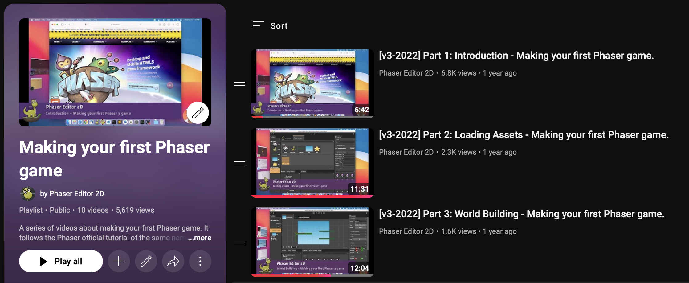

Let’s add an image to the `Level.scene` file created by the **Basic JavaScript** project template.

1. To upload an image to the project, right-click on the `assets` folder and select the **Add Files** option from the context menu. This will open the operating system's file chooser dialog.

   

   

2. Select the desired image, such as `background.png`. The image will be uploaded to the `assets` folder and displayed in the Files view.

   

3. Ensure the new image is selected in the Files view. In the Inspector view, you will find the properties of the image file. In the **Asset Pack Entry** section, there are two buttons to import the image into an [Asset Pack file](../asset-pack-editor/asset-pack-file). Click the **Import as image** button and select **Add To /assets/asset-pack.json**.

   

   The `assets/asset-pack.json` file is a Phaser configuration file that contains all the files you can load into a game. The Scene Editor uses this file to access images and other resources. You can add image files to the [Asset Pack file](../asset-pack-editor/asset-pack-file) using the previous method, or by opening the `assets-pack.json` file in the [Asset Pack Editor](../asset-pack-editor).

4. Now, in the Blocks view, you will see the new image. Drag the image and drop it into the middle of the scene. Press the `End` key to move the image to the bottom of the scene, or right-click on the image and select the **Edit** → **Move Bottom** option:

   

5. Save the scene (`Ctrl+S`) and [play the project](../workbench/playing-project) (`F12`).

There are multiple ways to add an image to the project, such as selecting the file in the system explorer and dropping it into the editor window. You can learn more about this process [here](../workbench/upload-dialog).

## Community tutorials

There are several content creators who have produced tutorials on Phaser Editor. In this section we recommend some of them:

[Phaser Editor v4 Beginner's Guide: Make Games Fast with Phaser 3!](https://www.youtube.com/watch?v=upx7DST2blA&list=PLmcXe0-sfoShBVVcab8kB0A_2KGf30ClP&index=3) by Scott Westover.

[Make your first Phaser game](https://www.youtube.com/playlist?list=PLB8gI_5U0MvBiK7GExn8ONPk5jDPd2KlE) by Arian Fornaris (made for version 3 of the editor, but can still be helpful for beginners)

