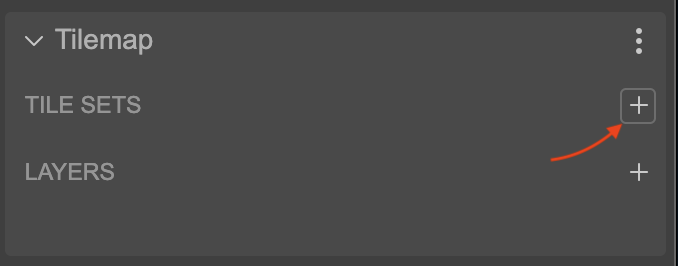
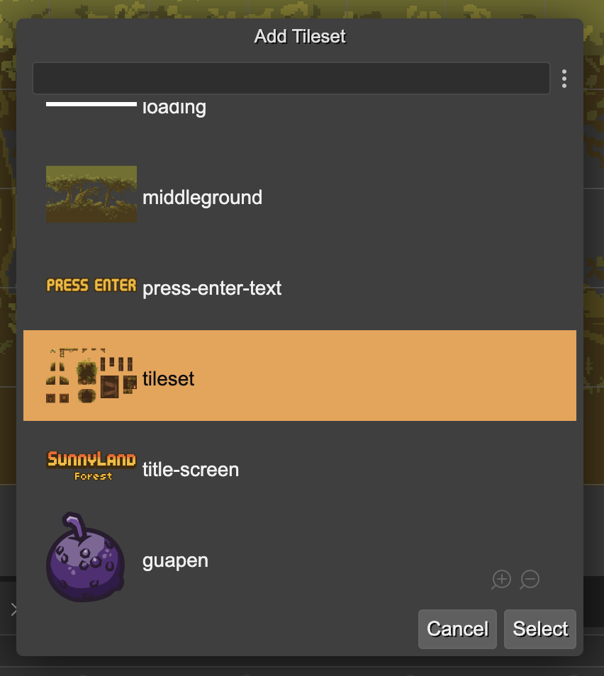
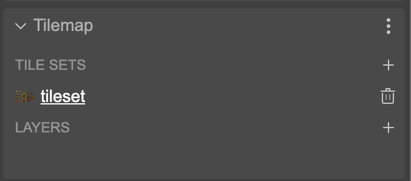
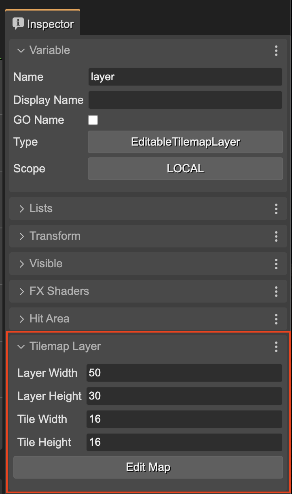
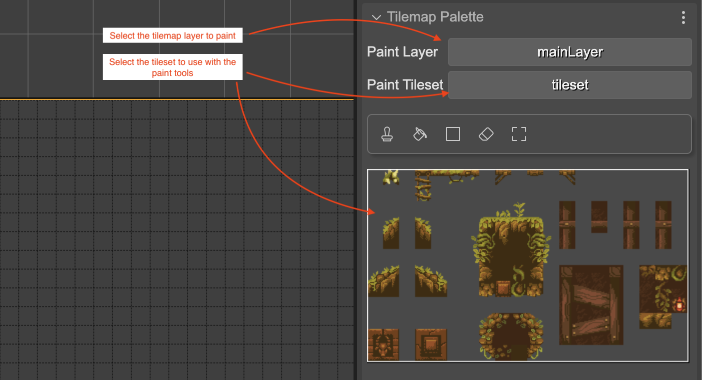
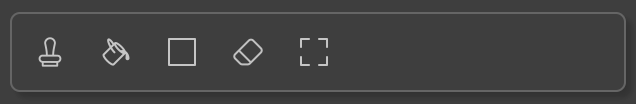
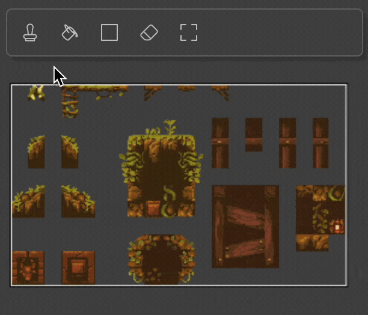

In Phaser Editor we have two types of tilemaps, those that you can create in Tiled and [import them into the scene editor](./tilemap-object.md), and those that you can create directly in the editor.

[Tiled](https://www.mapeditor.org) is a map editor that has been around for years and has incorporated all kinds of tools that make level creation easier for you. It is still one of the best options you have access to. However, a map editor built into Phaser Editor brings significant advantages when it comes to integrating the tilemap with other objects in the scene. In this section we will discuss how to create a tilemap using the tools in the scene editor.

## Creating an editable tilemap

To create an editable tilemap, drag the **Editable Tilemap** block from the Blocks view and drop it into the scene:


The editor immediately displays a dialog for setting the basic parameters of the tilemap, such as the number of columns and rows, and the size of the tiles:


The new tilemap object appears in the **Tile Map** category of the Outline view. You can change the name of the object in the **Variable** section of the Inspector view:


A tilemap is primarily made up of tilesets and tilemap layers. A tileset is an image that contains the tiles you will use to build the map. A tilemap layer is the game object where the tiles are drawn.

### Creating a tileset

The **Tilemap** section of the Inspector shows the tilesets and layers of the map. First, we need to create a tileset. To do this, we press the add button found in the **TILE SETS** section:  It opens a dialog with all the images and spritesheets defined in the asset packs of the projects. Pick the one for the tileset:  When you hit the **Select** button, it creates the new tileset for the map, with the same name of the asset. A tileset has multiple parameters. If you create it with a spritesheet asset as image, the tileset will copy many of the parameters of the spritesheet, like margin, spacing, tile width and tile height.

The new tileset is listed in the **TILE SETS** section:



You can click on the **Trash** icon to delete it or you can click on its name to change its properties:


In the tileset properties you can change its size and its image. Also, that section shows the **Edit Map** button which you can press to go back to editing the tilemap.

Below the tileset properties appears the **Tileset Preview** section, which shows the tileset image and the grid that demarcates the different tiles.
### Create a new tilemap layer

Once we have the tilesets ready, we can add new layers to the map. To do this, press the add button found in the **LAYERS** section:


The new layer will automatically take a name.


To change the name and other properties, you can click on the layer name or select the layer in the scene.



(To return to the tilemap properties, you can click on the **Edit Map** button)

The tilemap layer is a game object that appears in the scene, so you can also select it both in the scene and in the Outline view.


To delete a layer you follow the same procedure as any other game object, select it and press **Delete**.

## Drawing on a tilemap layer

To draw the cells of the tilemap, certain requirements must be met:

- Select an editable tilemap in the Outline view. This activates the "Edit tilemap" mode.
- Add at least one tileset and one tilemap layer.
- In the **Tilemap Palette** section of the Inspector view, select the tileset you want to draw with and the tilemap layer you want to draw on. Tiles are always drawn on a specific layer.



When you select the tilemap layer you want to draw, it is highlighted in the scene with an orange border and shows the grid on which you can paint the tiles.


The next step would be to select the tool you want to paint with, and the portion of the tileset you will use as a brush.

 

The next section explains in details how the tilemap tools works.

## Tilemap tools

At this point the tilemap editor provides some basic tools for painting on a tilemap layer. As explained in the previous section, to activate the "tilemap editor" mode you must select an editable tilemap, and select a tileset and a tilemap layer to paint on.

The tools are displayed in the toolbar, where you can select them. These are the tools available so far:



- **Stamp**: use the brush to stamp on the tilemap layer.
- **Bucket Fill**: use the brush to fill all empty cells or those with the same tile ID.
- **Rectangle Fill**: use the brush to fill a rectangular area.
- **Eraser**: to erase cells. It can use a bucket-fill like algorithm to delete the cells.
- **Rectangular Selection**: to select a region in the tilemap layer. It can be used to erase cells or create a brush with the selected cells.

### The brush

Many of the tools use a brush. Before we explain how each tool works, let's explain how you can select a brush.

A brush is a rectangular portion of the tileset. To select this portion, you must first select a tool that supports brushes, such as Stamp, Bucket fill, etc... Then, you must drag the mouse, starting from the top left corner of the brush to the bottom right corner. As you drag the mouse, you can see that the brush area is highlighted:



By the way, you can zoom in/out the tileset image with the mouse wheel, and pan the image by pressing the `Alt` key and dragging the mouse. Also, in the bottom of the image there are buttons to control  the zoom.

### Stamp tool

The Stamp tool is the most basic one. With it you can stamp the brush on the tilemap layer. To draw, you select a brush, then go to the tilemap layer and press the left mouse button. You can click to stamp the brush at the mouse position, or you can drag the mouse with the left mouse button pressed to paint the entire stroke:


### Bucket Fill tool

With the bucket-fill tool you can fill the entire space where you click. The space to fill is determined by those tiles that have the same ID and are neighbors.


### Rectangular Fill tool

With the rectangular-fill tool you can fill a rectangular space in the tilemap layer. The fill covers the entire rectangular area you select and draws a brush pattern.


### Eraser tool

With this tool you can erase the cells of the tilemap layer. You do not need to select a brush. Just drag the mouse over the layer to delete all the cells where the cursor passes. You also have the option to hold the `Shift` key and click on a cell to delete all neighboring cells with the same tile ID, following the bucket-fill algorithm.


### Rectangular Selection tool

With the rectangular selection tool you can select an area on the map and do two things: delete it by pressing the `Delete` key, or create a brush with the selection. To create a brush with the selection you must follow these steps:

- Select an area on the map.
- Press `Ctrl+C` (or `Ctrl+X` if you also want to cut the area). Automatically the editor activates the **Stamp** tool and loads the selected tiles as a brush.
- Draw on the map as you do regularly with the **Stamp** tool.


### Tileset Info tool

With this tool you can see the index of a tile in the tileset and the selected layer. The next image shows the tile index of the selected `mario-tileset` tileset and the selected `pipe` layer:


## Code generation

The usual practice in Phaser is to load tilemaps from an external file, such as an asset. This is because maps are designed with third-party tools and also because it makes it easier to load maps on demand. However, with this tilemap editor that we have incorporated into Phaser Editor we do things a little differently. Instead of saving the map data in an external file, such as a JSON file, we embed this data directly into the scene code. This may seem counterproductive to the developer who is used to the previous methods, however, it was the simplest option we found to release the first version of the tilemap editor. Including the tilemap data in the code (a long array of integers), also does not go against the philosophy of the editor, since no matter how large a scene of any type is, all objects are created through the code generated by the scene compiler. However, for future versions of the editor we may provide the option to generate the tilemap data in a separate file.

So when you create an editable tilemap, the compiler generates the code that loads a JSON object, in the format Tiled, into the loader cache. In this way, the tilemap instance is created using the usual Phaser API.

The code would look like this. First, the tilemap data is saved in the cache, following the `Tiled` format.

```js
// levelMap
this.cache.tilemap.add("levelMap_5ca7319c-74c6-458a-8589-37cef0ce2ff4", {
    format: 1,
    data: {
        width: 50,
        height: 30,
        orientation: "orthogonal",
        tilewidth: 16,
        tileheight: 16,
        tilesets: [
            {
                columns: 20,
                margin: 0,
                spacing: 0,
                tilewidth: 16,
                tileheight: 16,
                tilecount: 240,
                firstgid: 1,
                image: "tileset",
                name: "tileset",
                imagewidth: 320,
                imageheight: 192,
            },
        ],
        layers: [
            {
                type: "tilelayer",
                name: "mainLayer",
                width: 50,
                height: 15,
                opacity: 1,
                data: [0, 0, , 109, 109, 109, 109, ..., 109, 109, 109, 109],
            },
        ],
    },
});
```

Then the tilemap is created using the key of the data in the cache:

```js
const levelMap = this.add.tilemap("levelMap_5ca7319c-74c6-458a-8589-37cef0ce2ff4");
```

The tilesets are also created in the usual way. The `addTilesetImage()` method takes the name of the tileset as an argument:

```js
evelMap.addTilesetImage("tileset");
```

And finally, in the order they appear in the scene, the layers are created with the `createLayer()` method. This method receives as arguments the name of the layer, the tilesets used, and the position of the layer:

```js
// mainLayer
const mainLayer = levelMap.createLayer("mainLayer", ["tileset"], 0, 0);
```

Both the tilemap instance and the instances of the tilemap layers can be assigned to variables with different scopes, just as you can do with any other object in the scene.