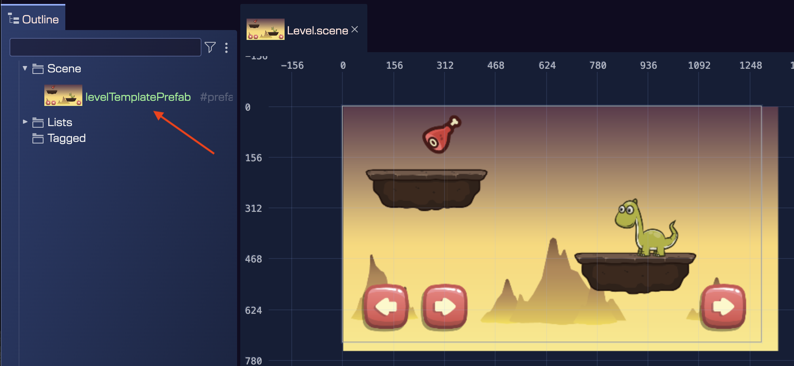

## Unboxing a prefab instance

A prefab instance can be unboxed to convert it into a regular group of objects. This means, that you can unlink an object from its immediate prefab definition, so the object becomes a regular object in the scene. However, it may be the case that the object is linked to a prefab that is a prefab variant of another prefab. In this case, unboxing the object will unlink it from its immediate prefab, but it will still be linked to the original prefab.

You can use this feature for different purpose, like using a certain prefabs as template to create objects in the scene, and then unbox them to modify them freely.

To unbox a prefab instance, select the object in the scene or in the Outline view, and execute the **Unbox Prefab Instance** command. You can find this command in context menu: **Prefabs** → **Unbox Prefab Instance**.

Let's see an example. This is scene has a `levelTemplatePrefab` prefab instance. This prefab contains the basic elements of a game level. Then, you can use it as a template to create different levels in your game:

Then, we execute the unbox command on the `levelTemplatePrefab` instance:

Then, the prefab instance is unboxed, and all its objects become regular objects in the scene:

