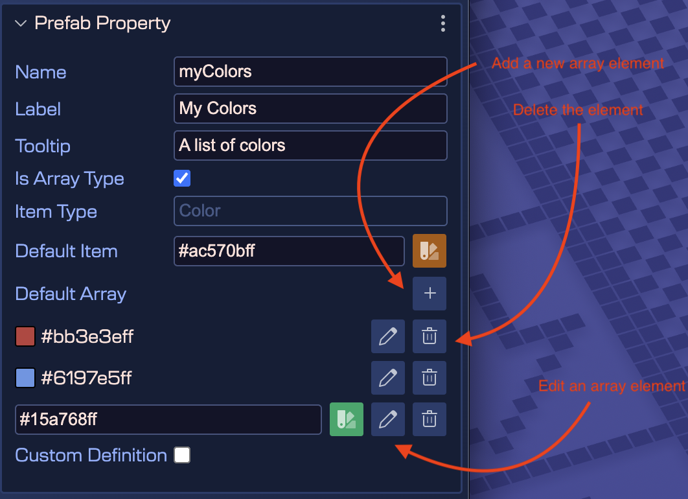

As we mentioned in previous sections, a Prefab extends a Phaser built-in type or another Prefab. This means a Prefab inherits the properties defined in the Phaser built-in types. However, you have the option to define new properties.

With Prefab user properties, you can create more reusable prefabs. You can express gameplay concepts: the “health” of a player, the “value” of a coin, the “speed” of an enemy, etc.

## Creating a prefab user property

The **Prefab Properties** section of the Inspector view shows a button to create a new user property. This section is shown when you select the scene (click on a blank space of the scene), or when you select the **Prefab Properties** element in the Outline view:


Click on the **Add Property** button to create a new property. It opens a dialog with the different type of properties:


The properties are shown as children of the **Prefab Properties** element. Click a property for editing it in the Inspector view:


All type of properties requires some common parameters that you should provide:

* The **Name** of the property. It is used by the compiler to generate a property declaration code. It should be a valid JavaScript identifier.
* The **Label**. It is a UI friendly version of the **Name**. For example, the label for the **maxSpeed** name could be **Maximum Speed**. In code, is generated a **maxSpeed** field, but the UI shows **Maximum Speed**.
* The **Tooltip**. Used in the UI as documentation of the property.
* The **Is Array Type** flag. If enabled, the property is an array of the selected type.
* The **Default** value.
* The **Custom Definition** flag. If enabled, the scene compiler skips the generation of the code with the property declaration. It allows you writing a custom implementation of the property. For example, using a custom getter and setter. Learn more about [using properties with custom definition](prefab-user-properties#using-properties-with-custom-definition).
* The **Editor Only** flag. If enabled, the property is only available in the editor, and it is not compiled in the generated code. It is useful for properties that are only used for editor-only metadata and functionality. For example, to use it in the [Object Display Format](./prefab-display-properties) parameter of a prefab.
* The **Deprecated** flag. If enabled, the property is marked as deprecated. Deprecated properties are hidden in the Inspector view unless they are unlocked. Use this flag when you want to phase out a property but keep it for backward compatibility.


The menu of the property section shows the following actions:

* Change the type of the property.
* Delete the property.

To change the order of the properties, go with the context menu’s **Edit** → **Move** commands.

You can undo/redo all these changes.


## Simple property type

The **Number**, **String**, and **Boolean** properties are the simplest. The scene compiler generates the properties as class fields. Note that each property is set to the **Default** value:

```javascript
class Dragon extends Phaser.GameObjects.Sprite {

    constructor(scene, x, y, texture, frame) {
        super(...);

        ...
    }

    /** @type {number} */
    maxSpeed = 100;

    /** @type {"fire"|"smoke"|"laser"} */
    flameType = "fire";

    /** @type {(obj:Dragon)=>void} */
    onClickHandler = obj => {};
}
```

## Option property type

The Option type allows the user to select one of the predefined string values. It is like traditional enum types. In addition to the common parameters, the Option properties have the **Options** parameter. You should write all the possible values with a valid JSON array syntax:


Note the **Default** value should be one of the possible values.

The compiled property is like this:

```javascript
class Dragon extends Phaser.GameObjects.Sprite {

    constructor(...) {
        super(...);
        ...
    }

    /** @type {"fire"|"smoke"|"laser"} */
    flameType = "fire";
}
```

## Color property type

The color property type accepts string values with the format of colors. It provides a dialog for picking a color and returns it with a hex format (including the alpha component).


The scene compiler generates the code for defining a Color property like this:

```javascript
class GoToSceneButton extends Phaser.GameObjects.Image {

    ...

    /** @type {string} */
    fadeOutColor = "#ffffffff";
}
```

And generates the code for setting the property in a scene:

```javascript
// goToSceneButton (prefab fields)
goToSceneButton.fadeOutColor = "#ff00b5ff";
```

There are many different ways of representing a color, you can use the [Phaser.Display.Color](https://docs.phaser.io/api-documentation/class/display-color) class for converting to different formats.

## Expression property type

The Expression type is the way you have to create a property of any type. You can use any type for the values and any JavaScript expression for setting the values. For example, you can use it to create a property to reference an event handler (or callback function):


The scene compiler generates Expression properties like this:

```javascript
class Dragon extends Phaser.GameObjects.Sprite {

    constructor(..) {
        ...
    }

    /** @type {(obj:Dragon)=>void} */
    onClickHandler = obj => {};
}
```

## Object Variable property type

This user property type is dedicated for referencing objects in the scene. It provides a dialog for selecting an object in the scene and sets as value of the property, the name of the variable referencig the object:


This property type if a subset of the [Expression property type](./prefab-user-properties#expression-property-type). You can define the type of the property. By default, it is `Phaser.GameObjects.Game`, but you can write any other type.

```javascript
class Eagle extends Phaser.GameObjects.Sprite {

  ...

  /** @type {Phaser.GameObjects.GameObject} */
  attackTarget;
}
```

The value set to this property is is verbatim-copied to the generated code:

```javascript
// eagle (prefab fields)
eagle.attackTarget = player;
```

## Game Object Reference property type

The Game Object Reference property type is similar to the [Object Variable property type](#object-variable-property-type), but it allows selecting strictly a game object from the scene, and keeps a real link with the object. With the Object Variable property type, the value is just a string with the name of the variable that references the object. With the Game Object Reference property type, the value is a reference (the ID) to the object itself. So the link is not lost if you change the variable name of the referenced object.

Another difference is that the Game Object Reference property allows setting a restriction on the objects it can reference. This restriction is based on the [prefab tags](./prefab-tags) or a game object type.

For example, if you want the property to only reference objects that have the `enemy` tag, you can define the property this way:


The **Filter Tags** parameter allows you to set a comma-separated list of tags. The property will only allow selecting objects that have at least one of the tags defined in this parameter. To select the tags, you can use the "folder" icon next to the parameter. It opens a dialog with the list of tags defined in the project. You can select one or more tags.

The **Filter Operator** parameter allows you to set the operator for filtering the objects. The available operators are **Match All** and **Match Any**. The **Match All** operator means that the object must have all the tags defined in the **Filter Tags** parameter. The **Match Any** operator means that the object must have at least one of the tags defined in the **Filter Tags** parameter.

In addition to tag-based filtering, you can also filter by game object type. For example, if you want the property to only reference objects of type `Phaser.GameObjects.Sprite`, you can set the Sprite value to the **Filter Object Type** property. Look next to the property there is a button to select the type:


## Object Constructor property type

With this property type you can create a user property for holding an object constructor (saying it in another way: a class). It’s like the [Expression property type](./prefab-user-properties#expression-property-type), but with a dialog for selecting a prefab class or built-in game object class.

Look in the next image, how you can select a prefab or a built-in Phaser type as expression:


It will generate a property definition like this:

```javascript
bulletCtr!: typeof Cherry & typeof Gem = Cherry;
```

This means, that you can use that property for creating a new object, a **Cherry** or **Gem** object:

```javascript
createBullet(x: number, y: number) {

    const bullet = new this.bulletCtr(this.scene, x, y);

    return bullet;
}
```
## Event property type

This type of property allows selecting an event name from a list of the Phaser events plus custom-defined events. It also allows writing any arbitrary event name.

To open the list of available events, click on the search button. It opens a dialog with the Phaser and custom events:


When you click on an event name, the bottom pane of the dialog shows the documentation.


### Dynamic keyboard events

Phaser provides the special `Phaser.Input.Keyboard.Events.KEY_DOWN` and `Phaser.Input.Keyboard.Events.KEY_UP` events. These events allow listening to the keys defined in the `KeyCodes` class, combining in this way:

```javascript
this.input.keyboard.on('keydown-SPACE', listener);
```

Where `SPACE` is a constant in the `KeyCodes` class, and `keydown` (or `keyup`) is the name of the event.

The Event property dialog shows all combinations of `keydown-` and `keyup-` with the `KeyCodes` values.


### Dynamic animation events

From the Phaser documentation:

The Animation Complete Dynamic Key Event.

This event is dispatched by a Sprite when an animation playing on it completes playback.
This happens when the animation gets to the end of its sequence, factoring in any delays
or repeats it may have to process.

The difference between this and the **ANIMATION_COMPLETE** event is that this one has a dynamic event name that contains the name of the animation within it.
For example, if you had an animation called explode you could listen for the completion of that specific animation by using:

`sprite.on('animationcomplete-explode', listener)`

The Event property dialog collects all the animations available in the [animation files](../../animations-editor) of your project and generates the `animationcomplete-key` events:


### Dynamic Spine events

[Spine](https://esotericsoftware.com) skeletons contain user events that are fired at a certain moment of an animation. The Event property dialog shows all the events defined in all the [Spine](https://esotericsoftware.com) skeleton assets present in the [Asset Pack files](../../asset-pack-editor/asset-pack-file):


[Learn more about the Spine events](https://esotericsoftware.com/spine-events)

The **Event** property type is a general type that allows selecting different Phaser events, including the Spine events. However, if you want to create a property specifically for selecting Spine events, you can use the **Spine Event** property type.

### Custom events

In addition to the Phaser events, the dialog shows custom events defined in an `events.txt` file. Since version 3.62.0 of the editor, this file is included in all project templates. However, you can create this file yourself in any folder of your project. The syntax is very simple. In every line, you define an event, and the name and the documentation are separated with a space. Like this:

```bash
my-event-name My event name documentation

# the editor ignores all lines starting with #
other-event My other event.
```

Then, the Event property dialog will show the custom events at the beginning of the list:


### Event code generation

The scene compiler generates the Event properties like this:

```bash
class Dragon extends Phaser.GameObjects.Sprite {

        constructor(..) {
                ...
        }

        jumpEvent = Phaser.Input.Events.GAMEOBJECT_POINTER_DOWN;
}
```
## Key Code property type

This type of property allows selecting one of the key codes available in the `Phaser.Input.Keyboard.KeyCodes` class:


You can use properties of this type for binding the behavior of an object or a game action with a certain keyboard key.


## Property code generation

The scene compiler generates the Key Code properties like this:

```javascript
class Dragon extends Phaser.GameObjects.Sprite {

        constructor(..) {
                ...
        }

        private jumpKey: number = Phaser.Input.Keyboard.KeyCodes.UP;
}
```
## Texture Config property type

This type of property allows to select a texture between all the textures defined in the an Asset Pack file. When the texture is selected, the property gets as value the configuration of the texture. For example, if the selected texture is an image with key **background**, the property is set to:

```javascript
{ "key": "background" }
```

If the selected texture is the frame **branch-01** of the atlas **atlas-props**, then the property is set to:

```javascript
{ "key": "atlas-props", "frame": "branch-01" }
```


The scene compiler generates Texture Config properties like this:

```javascript
class Dragon extends Phaser.GameObjects.Sprite {

    constructor(..) {
        ...
    }

    /** @type {{key:string,frame?:string|number}} */
    myTexture = {"key":"atlas-props","frame":"branch-01"};
}
```
## Asset Key property type

The Asset Key property type is just like a simple String property type, but it allows to open a dialog with all the [Asset Pack file](../../asset-pack-editor/asset-pack-file) keys defined in the project. Then, when you select a key in the dialog, it will be set as value to the property.


The scene compiler generates Asset Key properties like this:

```javascript
class Dragon extends Phaser.GameObjects.Sprite {

    constructor(..) {
        ...
    }

    /** @type {string} */
    myAssetKey = "acorn-3";
}
```

## Animation Key property type

This type is just like the [Asset Key property type](./prefab-user-properties#asset-key-property-type) but the dialog only shows the animations defined in the project.

Next to the animation key field, there is a button for selecting the animation key and a button for previewing the selected animation:


This is the dialog for selecting the animation key:


This is the dialog for previewing the selected animation:


## Audio Key property type

This type is like the [Asset Key property type](prefab-user-properties#asset-key-property-type) but the dialog only shows the audio assets:


## Scene Key property type

This user property type allows any string values but provides a dialog for selecting a scene key. This dialog shows all the scenes of the project and you can pick one. Then, its key is set as a value.


The scene compiler generates Scene Key properties like this:

```javascript
class GoToSceneButton extends Phaser.GameObjects.Sprite {

    constructor(..) {
        ...
    }

    /** @type {string} */
    jumpTo;
}
```

And the code it generates in the scene is like this:

```javascript
// goToSceneButton (prefab fields)
goToSceneButton.jumpTo = "Level";
```

## Spine Skin Name property type

This user property type allows any string values but provides a dialog for selecting a Spine skeleton skin. This dialog lists the names of all skins defined in all the [Spine](https://esotericsoftware.com) skeleton assets in the [Asset Pack files](../../asset-pack-editor/asset-pack-file) of the project. You can pick one name, then it is set as a value of the property.


The scene compiler generates Spine Skin Name properties like this:

```javascript
class Player extends SpineGameObject {

    constructor(..) {
        ...
    }

    theSkin: string;
}
```

And the code it generates in the scene is like this:

```javascript
player.theSkin = "Wolf02";
```

## Spine Animation Name property type

This user property type allows any string values but provides a dialog for selecting an animation name. This dialog lists the names of all animations defined in all the [Spine](https://esotericsoftware.com) skeleton assets in the [Asset Pack files](../../asset-pack-editor/asset-pack-file) of the project. You can pick one name, then it is set as a value of the property.


The scene compiler generates Spine Animation Name properties like this:

```javascript
class Player extends SpineGameObject {

    constructor(..) {
        ...
    }

    startAnimation: string;
}
```

And the code it generates in the scene is like this:

```javascript
player.startAnimation = "idle";
```

## Spine Slot Name property type

This user property type allows any string values but provides a dialog for selecting a Spine skeleton slot name. This dialog lists the names of all slots defined in all the [Spine](https://esotericsoftware.com) skeleton assets in the [Asset Pack files](../../asset-pack-editor/asset-pack-file) of the project. You can pick one name, then it is set as a value of the property.


The slot name selection dialog groups the slot names by skeleton asset:


## JSON property type

The JSON property type allows you to create a user property that can hold JSON data. It provides a text area for entering JSON-formatted text, and it validates the input to ensure it is valid JSON. The validation is based on the standard JSON syntax and the **JSON Schema** parameter, if provided.

This is an example of a JSON schema for an object with the `items` property that us an array of tuples with the `name` and `points` fields:

```json
{
  "$schema": "https://json-schema.org/draft/2020-12/schema",
  "type": "object",
  "properties": {
    "items": {
      "type": "array",
      "items": {
        "type": "object",
        "properties": {
          "name": {
            "type": "string"
          },
          "points": {
            "type": "number"
          }
        },
        "required": ["name", "points"],
        "additionalProperties": false
      }
    }
  },
  "required": ["items"],
  "additionalProperties": false
}
```


To edit the JSON data, the editor shows a dedicated dialog with syntax highlighting, validation and auto-completion:


The scene compiler generates the JSON values as JSON objects:

```javascript
myPrefab.myData = {
    "items": [
        {
            "name": "coin",
            "points": 10
        },
        {
            "name": "apple",
            "points": 5
        }
    ]
```

## Array properties types

New in Phaser Editor 5 we added the support for user properties of type Array. This allows you to create properties that can hold multiple values, like a list of items or a collection of objects. This mean you can declare any previous user property type as an Array.

To declare a property as an Array, you can set the **Is Array Type** flag:


When you select this option, the **Type** parameter becomes the **Item Type** parameter, and refers to the type of the Array items. The **Default** parameter becomes the **Default Item** parameter, and refers to the default value of the Array items.

In addition, you can set the default items of the array. The **Default Array** parameter displays the list of default array items. You can add, remove or edit the array elements:



Very similar is the UI for setting array values in prefab and user component instances:


## Initializing other properties

It’s possible you want to change other properties of the prefab instance, in dependence of the values of the user properties. For example, if the **flameType** property value is `"fire"`, then you set the mass of the body to `50`. Because the property values are not set in the constructor, you can listen to the `scene-awake` event and setup the body properties:

```javascript
class Dragon extends Phaser.GameObjects.Sprite {

    constructor(scene,...) {
        ...

        /* START-USER-CTR-CODE */

        scene.events.once("scene-awake", this.awake, this);

        /* END-USER-CTR-CODE */
    }

    /** @type {"fire"|"smoke"|"laser"} */
    flameType = "fire";

    /* START-USER-CODE */

    awake() {

        // at this point, all objects in the scene are created
        // and the user properties are set with new values

        if (this.flameType === "fire") {
            this.body.mass = 50;
        }
    }

    /* END-USER-CODE */
}
```

If you enable the **Generate Awake Handler** flag in the **Compiler Prefab Settings**, the scene compiler will generate this code for you:


```javascript
class Level extends Phaser.GameObjects.Image {

    constructor(scene,...) {

        // awake handler
        this.scene.events.once("scene-awake", () => this.awake());

        ...
    }
}
```

It is your responsibility to write the `awake` method.

### The `scene-awake` event

The `scene-awake` event is not part of the Phaser API. It’s a custom event the Scene Editor uses as convention. When the scene compiler generates the code of a scene, it also generates the code for emitting the `scene-awake` event. This event is emitted just after all objects are created:

```javascript
class Level extends Phaser.Scene {
...
    editorCreate() {
        ...

        // dragon
        const dragon = new Dragon(this, 370, 218);
        this.add.existing(dragon);

        ...

        // dragon (prefab fields)
        dragon.maxSpeed = 300;
        dragon.flameType = "smoke";
        dragon.onClickHandler = obj => this.selectDragon(obj);
        ...

        this.events.emit("scene-awake");
    }
...
}
```

As we mentioned in the previous sections, prefabs and [user components](../user-components) can listen to this event for reading the values set to the user properties.

It is important that you keep in mind that if you create a dynamic prefab instance, and it requires the `scene-awake` event, then you should call it manually:

```javascript
spawnDino(scene, x, y, flame) {

    const dragon = new Dragon(scene, x, y);
    dragon.flameType = flame;
    // send the awake notification to the new object
    scene.events.emit("scene-awake");
}
```

Because the `scene-awake` event is listened once in prefabs and [user components](../user-components), only the new objects will be notified.

As alternative to the `scene-awake` event, you can listen the `Phaser.Scenes.Events.UPDATE` event. It is emitted by the scene at every tick, so you just need to register the listener to be called **once**:

```javascript
scene.events.once("Phaser.Scenes.Events.UPDATE", this.start, this);
```

Note that if you need to “awake” prefab before the game starts updating, you should listen to the `scene-awake` event.

The `scene-awake` event is also used by components, [learn more about it](../user-components/user-components-awake-event).

## Using properties with custom definition

You can set a user property with a **Custom Definition**:


This means, the scene compiler skips the definition of the property. For example, if you set the `flameType` as **Custom Definition**, the `flameType` property declaration isn’t generated. Instead, a `flameType` property initialization is included in the constructor:

```javascript
class Dragon extends Phaser.GameObjects.Sprite {

    constructor(scene,...) {
        ...

        // the compiler adds this
        this.flameType = "fire";
    }

    // the compiler skips this:
    // flameType = "fire";
}
```

Then, you can write a custom setter and initialize other fields of the prefab:

```javascript
class Dragon extends Phaser.GameObjects.Sprite {

    constructor(scene,...) {
        ...
        this.flameType = "fire";
    }

    /* START-USER-CODE */

    set flameType(flameType) {

        // update the body with the flameType

        if (flameType === "fire") {
            this.body.mass = 50;
        }
    }

    /* END-USER-CODE */
}
```

Note that you don’t need to listen for the `prefab-awake` event anymore. Setting the `flameType` property will update the prefab state in the expected way. It’s possible you also need to define a getter for the `flameType`. If that’s the case, you can store its value in a new field, or compute it.

## User properties in a prefab instance

This is how the properties you defined in a Prefab are presented in the **Prefab Instance** section of a Prefab instance:


The Inspector view shows a section for every Prefab (and prefab variant) of the object. The user properties are shown just like any other property of a Prefab instance.

Each section contains a menu with the options:

* **Open Prefab**: opens the prefab file.
* **Select All Prefab**: select all objects in the scene instancing the same prefab.


The code, generated by the scene compiler, that creates the Prefab instance and initialize the properties will look like following. Note the **dragon** instance is created first, and the user properties are initialized later, at the end of the method. By setting the user properties at the end, it allows you to set references to another objects created in the scene:

```javascript
class Level extends Phaser.Scene {
...
    create() {
        ...

        // dragon
        const dragon = new Dragon(this, 370, 218);
        this.add.existing(dragon);

        ...

        // dragon (prefab fields)
        dragon.maxSpeed = 300;
        dragon.flameType = "smoke";
        dragon.onClickHandler = obj => this.selectDragon();
        dragon.emit("prefab-awake");
        ...
    }
...
}
```

In the next sections are covered the topics to create Prefab instances and to change the properties.

