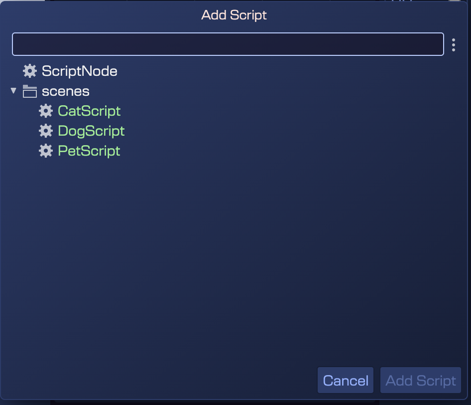

Script Nodes are a powerful tool for creating a hierarchy of reusable behaviors in your game. However, it is sometimes necessary to restrict how these nodes can be connected or used to keep the game logic consistent and avoid errors. This is especially useful when you have developers and designers working together on the team, and you want to make sure that the nodes are connected consistently and follow the rules of the game.

For this, we have implemented a constraint system that allows you to define which Script Nodes can connect to each other.

There are two types of constraints that you can apply to your Script Nodes:

- General constraints: These constraints can evaluate the context of the Script Node and decide whether the connection is valid or not. For example, you could have a constraint that checks if a Script Node is added to a scene and not to an object. Or validate if the node has a no-children constraint, which means it cannot have any child Script Nodes connected to it.
- Type constraints: these constraints define what type of Script Nodes can connect to each other. For example, you can allow a Script Node of type "Event" to only connect to Script Nodes of type "Action".
- Tag constraints: These constraints allow a Script Node to connect only to other Script Nodes that [have a specific tag](../prefabs/prefab-tags).

*(Learn more about [prefab tags](../prefabs/prefab-tags))*

These restrictions will be taken into account when connecting Script Nodes in the Scene Editor. If a Script Node does not comply with the defined restrictions, it will not be able to connect to another object. Therefore, the dialog where the Script Nodes available for connection are shown, will only display those that comply with the restrictions of the object to which you are trying to connect.

The following image shows the **Add Script** dialog when the user tries to add a new node script to a "list of pets" script. As you can see, it only shows the "pets" scripts, filtering out the ones that do not meet the constraints defined in the prefab of the "list of pets" script node.

## Adding Constraints to Script Nodes

As we have explained in previous chapters, to create your own Script Node you must create a Script Node prefab. Therefore, it is there that you must define the constraints that you want to apply to your Script Node.

In particular, we have introduced a new section of the Inspector view called **Prefab Constraints**. It contains a list of the constraints you have already added to the prefab, a button to add a new constraint (**Add Constraint**), and the parameters where you set the logical operators that will be used to combine the constraints.

### Constraints list

The constraints list shows the constraints you have already added to the prefab. It is important to note that constraints are inherited. That is, a prefab variant inherits the constraints from the original prefab. Therefore, if you add a constraint to a prefab variant, it will be combined with all the prefabs that inherit from it.

Let's look at an example of a **DogScript** prefab that inherits from a **PetScript** prefab. The prefab **PetScript** has the constraint `Parent has tag "list of pets"`, and the prefab **DogScript** has the constraint `Child is instance of 'DogPartScript'`.

The following image shows the Inspector view of the **DogScript** prefab. As you can see, both constraints are listed in the **Prefab Constraints** section:

Look you can only delete the local constraints, not the inherited ones. If you want to delete an inherited constraint, you must do it in the parent prefab.

### Adding a new constraint

The **Add Constraint** button allows you to add a new constraint to the prefab. Clicking this button will display a menu with the available constraint options. You can choose between:

- **Parent has tag** - Allows the Script Node to connect only if its parent has a specific tag. When you select this option, a dialog will appear where you can select the tag you want to use as a constraint.
- **Child has tag** - Allows a child node to only connect to this node if the child node has a specific tag.
- **Parent is instance of** - Allows the Script Node to connect only if its parent is an instance of a specific prefab or Phaser game object type. When you select this option, a dialog will appear where you can select the prefab or Phaser type you want to use as a constraint.
- **Child is instance of** - Allows a child node to only connect to this node if the child node is an instance of a specific prefab or Phaser game object type.
- **Parent is the scene** - Allows the Script Node to connect only if its parent is the scene. This constraint is useful for Script Nodes that must be added to the scene and not to a specific object.
- **No children allowed** - Allows the Script Node to have no child nodes connected to it. This constraint is useful for Script Nodes that should not have a hierarchy of child nodes.

### Logic operators

The **Condition** parameter allows you to set the logical operator that will be used to combine the local constraints. You can choose between **Match All** or **Match Any**. Match All means that all constraints must be true for the connection to be valid. Match Any means that at least one of the constraints must be true for the connection to be valid.

The **Inheritance Condition** parameter allows you to set the logical operator that will be used to combine the inherited constraints. You can choose between **Match All**, **Match Any** or **Override**. To determine if a connection is valid, the system will first check the inherited constraints and then the local constraints, then combine both results using the selected operator in the **Inheritance Condition**. If the operator is set to:

- **Match All**: The inherited constraints result should be true, and the local constraints result must be true for the connection to be valid.
- **Match All**: The inherited constraints result should be true, or the local constraints result must be true for the connection to be valid.
- **Override**: The inherited constraints result is ignored, and only the local constraints result is used to determine if the connection is valid.