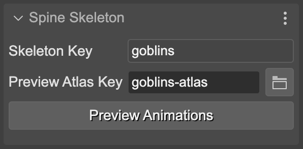

There are different contexts in Phaser Editor where there are [Spine](https://esotericsoftware.com) assets and you can preview them: in the [Asset Pack Editor](../../asset-pack-editor) and the Blocks view of the Scene Editor.

For displaying and inspecting Spine objects, the [Spine Phaser runtime](https://esotericsoftware.com/spine-phaser) requires the skeleton data file and the atlas files. If you follow the default [Spine](https://esotericsoftware.com) assets [naming rules](spine-animations-loading#spine-assets-default-naming-rules), then Phaser Editor can build the skeleton instances and preview them.

In the next sections we explain it in details.

## Preview Spine atlas assets

The [Asset Pack Editor](../../asset-pack-editor) shows the [Spine](https://esotericsoftware.com) atlas assets you add to an [Asset Pack file](../../asset-pack-editor/asset-pack-file). If you select it in the editor, the Inspector view shows you all the atlas frames:

## Preview Spine skeleton and animation data

You can select a [Spine](https://esotericsoftware.com) skeleton data in the [Asset Pack Editor](../../asset-pack-editor) or the Blocks view of the Scene Editor. In both cases, the Inspector view shows two sections of properties: the **Spine Skeleton** and the **Spine Preview**.

The **Spine Skeleton** shows the **Skeleton Key** and **Preview Atlas Key**. By default it guesses the atlas key from the skeleton key, but you can change it if you need to.

The **Spine Preview** section displays the skins defined in the skeleton data:

## Preview Spine animations

Notice the **Spine Skeleton** section contains a **Preview Animations** button. It opens the **Spine Preview** dialog.

In this dialog, you can play the skeleton animations and change other properties like the skin.

Let’s go parameter by parameter.

### Skin preview

You can change the preview skin by pressing in the **Skin** button:

### Animation and Track

With [Spine](https://esotericsoftware.com) you can play simultaneous animations on different tracks. With the **Track** button you can select the track ID for playing the animation you select in the **Animation** button.

In the next image, you can see it is playing the **idle** animation in **Track 0**, and the **shoot** animation in **Track 1**.

When you select an animation in the **Animation** button, it plays it immediately on the selected track:

The animation is played in a loop if the **Loop** parameter is checked.

If the **Events** parameter is checked, then the canvas shows the name of the events the animation emits. Look in this image the **footstep** events:

Also, you can set the **Default Mix** and **Time Scale** of the animation. The **Default Mix** is applied when you change from one animation to another.

[Learn more about applying animations in the Spine Phaser runtime](http://esotericsoftware.com/spine-phaser#Applying-Animations)

## Animation Events

The Animations Events sections shows the list of events emitted by the current animation. It shows the time and the name of the event.

