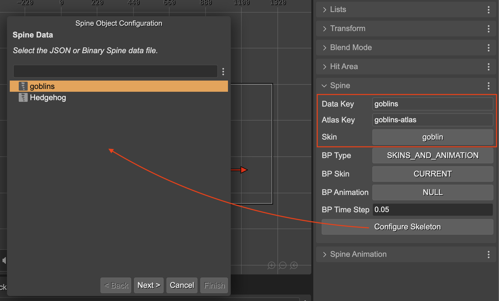
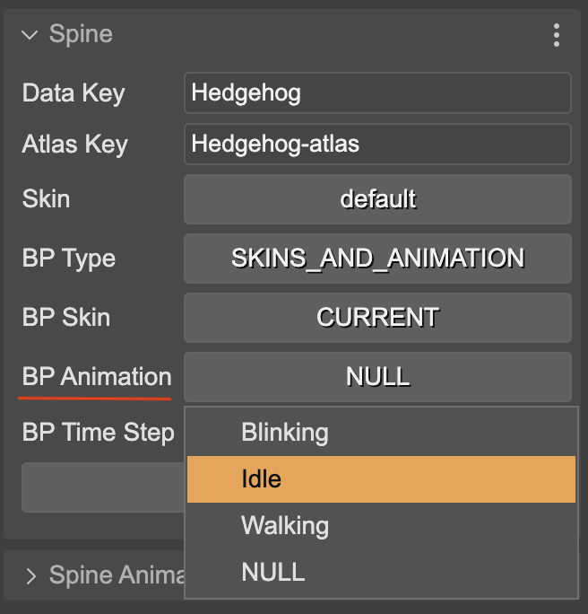
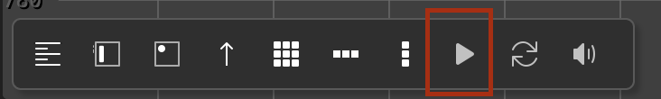

The Inspector view shows the properties of the [SpineGameObject](spine-animations-game-object) instance you select in the scene.

The **Spine** section shows the **Data Key**, **Atlas Key**, and the **Skin** name.

You can re-configure these values by pressing the **Configure** button. It shows a configuration dialog where you can select skeleton, atlas, and skin:

That’s the only way of changing the skeleton and atlas of an object, but you can change the skin straight in the **Skin** parameter:

The **Data Key** and **Atlas Key** properties can be set to the Spine object only via the constructor. For that reason, the scene compiler uses the especial **xargs** argument to set these properties on nested prefabs. [Learn more about the xargs](../prefabs/prefab-nested#the-nested-prefab-constructor-and-the-xargs).

## Bounds provider properties

The bounds provider is responsible for computing the size of the [SpineGameObject](spine-animations-game-object). By default, it uses the setup pose bounding box. There are two built-in implementations of the bounding box: the **SetupPoseBoundsProvider** (default) and the **SkinsAndAnimationBoundsProvider**.

The **Spine** section in the Inspector view contains the parameters for setting the bounding box to the game object:

With the **BP Type** you select the bounds provider type: **SETUP_POSE** (`SetupPoseBoundsProvider``) or **SKINS_AND_ANIMATION** (`SkinsAndAnimationBoundsProvider`).

The other parameters are only valid if you select the **SKINS_AND_ANIMATION** bounds provider. This provider uses an animation and an array of skins for computing the bounds.

You can select the skins for the bounds provider in the **BP Skin** parameter. It gives you two options: **CURRENT** (uses the current skin in the game object) or **ALL** (uses all skins available in the game object’s skeleton data).

With the **BP Animation** parameter you can select what animation to use for the bounds provider. It lists all the animations available in the skeleton data.

With the **BP Time Step** parameter you can set the precision of the algorithm for computing the bounding size. A smaller time step means more precision, but slower calculation.

## Animations properties

The **Spine Animation** section contains the animation properties.

**Time Scale**: To play the animations and mixes slower or faster. Default `1`.

**Default Mix**: The mix duration to use when no mix duration is defined in the between two animations.

**Mixes**: The mix duration between two animations.

The **Mixes** button shows the number of defined animation mixes. Click on it to edit the mixes. It opens the [Spine Game Object preview dialog](#spinegameobject-preview) where you can edit and preview the mixes:

## SpineGameObject in-scene preview

De la misma forma que puedes previsualizar las [sprite animations](../game-objects/common-object-properties#animation-properties) y los [particle emitters](../game-objects/particle-emitter-object-properties#preview-properties), también puedes visualizar las Spine animations en la propia escena del editor.

To enable the in-scene preview, you must first select the ***Run Preview Animation** option from the **Spine Preview** section. The following parameters **Preview Loop**, **Preview Time**, and **Preview Animation** are only dedicated to the in-scene preview, and do not affect the state of the object in the game.

The **Preview Animation** will select the animation to preview. The **Preview Loop** will play the animation in a loop. The **Preview Time** will advance the preview animation to the given time in milliseconds. It doesn't require that you run the update loop. It is useful to get a static preview of the animation at a specific moment.

That's important that you have enable the [update loop in the scene editor](../misc#play-scene-update-loop), otherwise the preview animation will not run smoothly.

## SpineGameObject preview window

You can preview a [SpineGameObject](spine-animations-game-object) by pressing the **Preview Window** button in the **Spine Preview** section.

It opens the a preview dialog where you can select the animation name, the animation track, and other parameters.

This dialog is similar to the [Spine Preview dialog](spine-animations-assets-preview#preview-spine-animations), but it also allows editing some properties of the game object, like the default mix, the animation mix, and the time scale:

The dialog has two sections: **Preview** and **Settings**. The Preview section has the **Preview Track**, **Preview Animation**, **Preview Loop**, and **Preview Events** parameters. It works just like in the [Spine Preview dialog](spine-animations-assets-preview#preview-spine-animations), and it doesn’t affect the object state.

The **Settings** contains the **Time Scale** and **Default Mix** parameters. If you change those parameters and press the **Update** button, then values are set to the game object and persisted in the scene.

In addition, you can set the animation mix values of the game object:

[Learn more about the Spine animation concepts](https://esotericsoftware.com/spine-phaser#Applying-Animations)