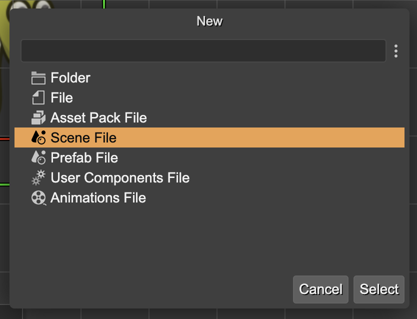
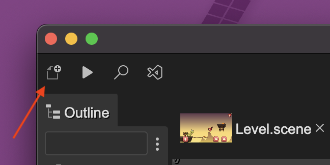

The **New File dialog** shows the different types of files you can create. When you select a type of file, it launches a dedicated dialog to create the file. These specific file dialogs are contributed by the different plugins.

To open the New File dialog you can click on the **New File** button of the [Main toolbar](../workbench/main-toolbar) or press the `Ctrl+Alt+N` keys.

