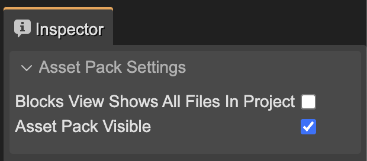

You can place an Asset Pack file in any folder, however, we recommend placing these files in the folders dedicated to the game assets, for example: `assets/pack.json`.

You usually need more than one [Asset Pack file](../asset-pack-editor/asset-pack-file): at least, one for the Preloader scene and another for the rest of the game scenes.

Sometimes, you need to use “helper” assets in the Scene Editor, assets that you use in the Scene Editor as a reference but are not included in the game. You can group all these assets with their own Asset Pack file in a separate folder, and exclude the folder from the game build.

This could be the structure of your project:

```bash
assets/
   preload/
     preload-pack.json
     ... # preloader assets
   levels/
     levels-pack.json
     ... # level assets
   helpers/
     helper-pack.json
     ... # helper assets
```

The [Asset Pack Editor](../asset-pack-editor) searches for files inside the folder containing the [Asset Pack file](../asset-pack-editor/asset-pack-file), and you can make it more effective if the structure of the project is well organized.

[Learn how to add entries to an Asset Pack file](add-file)

## Skin-like assets

If your game has characters or objects with different skins, you can organize the assets in a way that makes it easy to switch between skins. For example, you can create a folder for each skin and place the assets inside it. Then, you can create an Asset Pack file for each skin. In the **Asset Pack Settings**, you can turn an asset pack visible or invisible, so you can switch between skins by enabling or disabling the Asset Pack file. This **Asset Pack Visible** parameter only applies to the editor tools, because in the game you can still load all the skins (asset pack files). The "visible" property is only a trick to make filter assets in the editor:



The **Asset Pack Settings** shows in the Inspector view when no object is selected in the Asset Pack editor.


