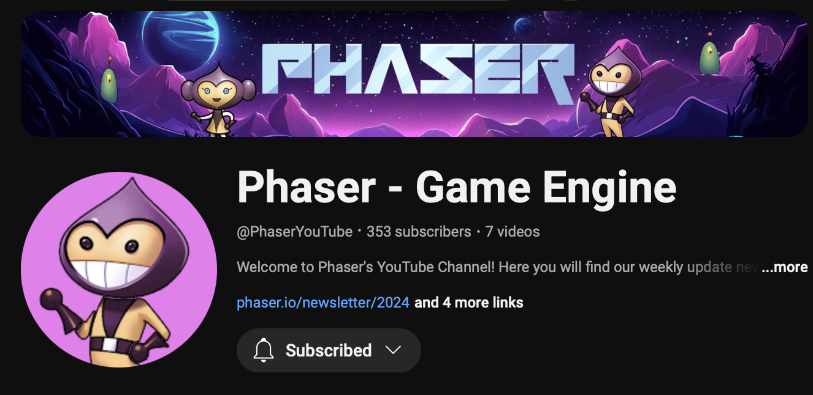

Welcome to Phaser Editor v4 documentation!

Phaser Editor is a powerful and user-friendly development environment tailored for creating games with the Phaser game framework. Whether you're a seasoned developer or just starting with game development, Phaser Editor streamlines the process of building interactive and immersive 2D games.

This documentation provides a comprehensive guide to using Phaser Editor's rich set of tools, from loading the assets to setting up your animations and scenes. You’ll find detailed explanations of all the core features, including Project Templates, Assets Management, Visual Scene Editor, Animations Editor, Code Assistance, and much more.

## Why Phaser Editor?

Phaser Editor accelerates your workflow by offering a fully integrated game development experience. It's built specifically to work seamlessly with the Phaser framework, ensuring that you can focus on creating amazing games without getting bogged down by complex setup or configuration.

With Phaser Editor you can start new projects but you can also migrate "handmade" Phaser projects relatively easily.

Let’s dive in and start creating incredible games together!

## Main features

### Asset Pack Editor

The [Asset Pack Editor](../asset-pack-editor/intro) allows you to import the asset files into an [Asset Pack file](../asset-pack-editor/asset-pack-file). This pack file is used by other components of the IDE, like the Scene Editor and is a built-in Phaser format. This means, that you can load it in any Phaser game, no matter if it was created by Phaser Editor or another tool.

Often, Phaser game developers have to write by hand the code to load the asset files. With the [Asset Pack Editor](../asset-pack-editor/intro) this process is fully visual and assisted.

[Learn more about the Asset Pack Editor](../asset-pack-editor/intro)

### Scene Editor

The Scene Editor is a visual tool to create Phaser scenes by positioning images and other types of objects.

It supports a wide range of Phaser game objects and features. You can create complex scenes. A powerful system of prefabs, user components, and script nodes allows you to create reusable scenes and behaviors.

The Scene Editor supports multiple third-party formats like [Spine](https://esotericsoftware.com) animations and [Tiled](https://www.mapeditor.org) maps.

This a quick index of the main features:

- A wide spectrum of [game objects](../scene-editor/game-objects) like image, sprite, nine-slice, bitmap text, layer, and more.
- [Sprite animations](../scene-editor/sprite-animations) 
- [Tilemaps](../scene-editor/game-objects/editable-tilemap-object)
- [Arcade physics](../scene-editor/arcade-physics/)
- [Filters](../scene-editor/filters)
- [Spine animations](../scene-editor/spine-animations)
- [Particle emitters](../scene-editor/game-objects/particle-emitter-object)
- [Prefabs](../scene-editor/prefabs)
- [User components](../scene-editor/user-components)
- [Script nodes](../scene-editor/script-node)
- [Layout tools](../scene-editor/layout-tools)

The Scene Editor is a visual tool and uses a custom scene format, but it does not hide the Phaser code. You can see the code of the scene and edit it directly in the editor or an external JavaScript editor like [Visual Studio Code](https://code.visualstudio.com).

[Learn more about the Scene Editor](../scene-editor/intro)

### Animations Editor

The [Animations Editor](../animations-editor/intro) helps to create sprite-based animations. It creates a JSON file that can be loaded into the game using the [Phaser Loader API](https://docs.phaser.io/api-documentation/class/loader-loaderplugin#__animation) or using the [Asset Pack Editor](../asset-pack-editor/intro).

A handy tool provided by the [Animations Editor](../animations-editor/intro) is the [automatic creation of the animations](../animations-editor/auto-build-animations).

### Code Editor

An advanced coding tool is out of the scope of this version of the IDE. There are free and commercial third-party coding editors that work pretty well, with special mention of [Visual Studio Code](https://code.visualstudio.com).

Phaser Editor can be integrated very well with [Visual Studio Code](https://code.visualstudio.com). The [project templates](../first-steps/create-first-project) include the [Visual Studio Code](https://code.visualstudio.com) the configuration and type files required to get a project ready for [Visual Studio Code](https://code.visualstudio.com).

However, many users may want to try the editor just as it is and quickly create prototypes of games. For those users, we included in the IDE a basic code tooling for JavaScript, TypeScript, HTML, CSS, and JSON files. These tools are based on the [Monaco editor](https://microsoft.github.io/monaco-editor/), the one that is used by [Visual Studio Code](https://code.visualstudio.com).

You can edit the code of your game and get nice features like auto-completion across multiple files, an outline of the code, documentation of the language elements, and others.

[Learn more about the Code Editor](../code-editor/intro)

### Project templates

Phaser is a framework and it does not require a particular layout for your projects. A Phaser game is just a web application, and there are a lot of options to organize and build your game files.

Phaser Editor does not require any special project layout neither, however, it provides a couple of project templates that help you to do an initial setup of your game. For example, it adds configuration files ready to be used by [Visual Studio Code](https://code.visualstudio.com) and other files commonly used by the IDE, like an [Asset Pack file](../asset-pack-editor/asset-pack-file) or a first Scene Editor file.

Also, you can create projects based on demos, and learn Phaser and Phaser Editor.

[Learn more about project templates](../first-steps/create-first-project)

### Lightweight and cross-platform

The IDE is available in the main Operating Systems: Windows, macOS, and Linux.

The big part (the client application) should run in any modern browser (tested on Google Chrome, Firefox, and Opera), and is served by a small native program, available for the mentioned platforms.

The client application is accelerated by the browser and all the I/O operations are asynchronous. It feels lightweight in terms of operability, but it may push the browser to consume an extra 150MB/300MB of memory. It depends the amount of images present in the project.

On the desktop, it loads pretty fast. In a network, the fetching of all the resources may delay, it depends on your network speed.

### Ready for the desktop and the cloud

The editor is distributed as two different products, the [Phaser Editor Core](../intro/distributions#phaser-editor-core) and the [Phaser Editor Desktop](../intro/distributions#phaser-editor-desktop).

The [Phaser Editor Core](../intro/distributions#phaser-editor-core) can be integrated into a modern web development stack and cloud-based development environments (like [Gitpod](https://gitpod.io) and [GitHub Codespaces](https://github.com/codespaces)).

The [Phaser Editor Desktop](../intro/distributions#phaser-editor-desktop) is a desktop application that provides a traditional IDE-like experience.

## Tutorials

A lo largo de la vida del editor varios creadores de contenidos han elaborado tutoriales para aprender a utilizar Phaser Editor. Aquí te dejamos las referencias a algunos de ellos:

[Phaser Studio YouTube channel](https://www.youtube.com/@PhaserYouTube/playlists)

[Scott Westover - Phaser Editor playlist](https://www.youtube.com/playlist?list=PLmcXe0-sfoShBVVcab8kB0A_2KGf30ClP)

[Legacy Phaser Editor 2D tutorials](https://www.youtube.com/@PhaserEditor2D)

[Legacy Ourcade/SuperTommy tutorials](https://www.youtube.com/playlist?list=PLNwtXgWIx3riMHtFVL_x2PkiNhwPtX0gJ)
