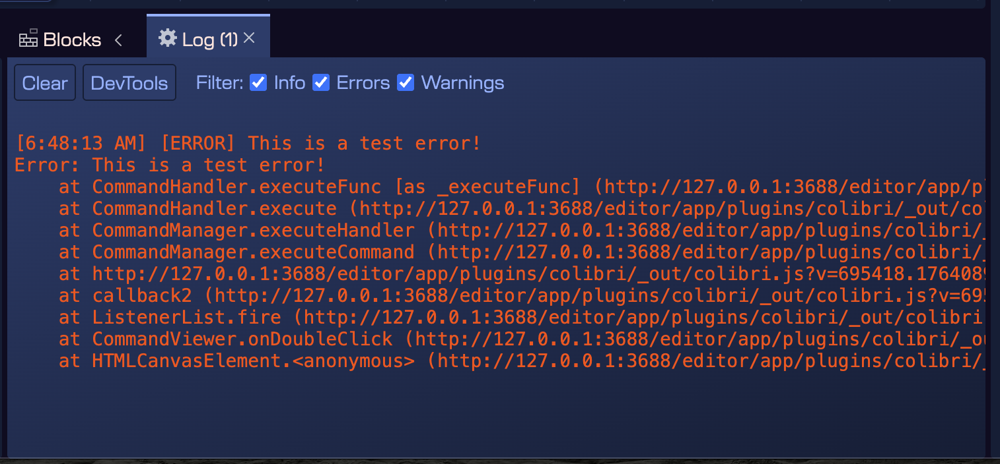

The editor is in active development and as any software, it may contain bugs. When a bug is detected, it is important to report it to the development team, so it can be fixed in future releases. For this purpose, we added a new **Log view** in the Workbench.

This view will show log messages generated by the editor, including error messages, warnings, and informational messages. This view is shown only when an error or warning is logged, so it does not interfere with the normal workflow of the editor.

The elements of the Log view are:

- **Clear** button: clears the log messages.
- **DevTools** button: opens the developer tools of the editor. This is useful for advanced users and developers to inspect the internal state of the editor, which is based on Electron, which is based on the Chromium browser.
- **Filter** section: allows selecting the type of messages to show: Errors, Warnings, and Info messages.
