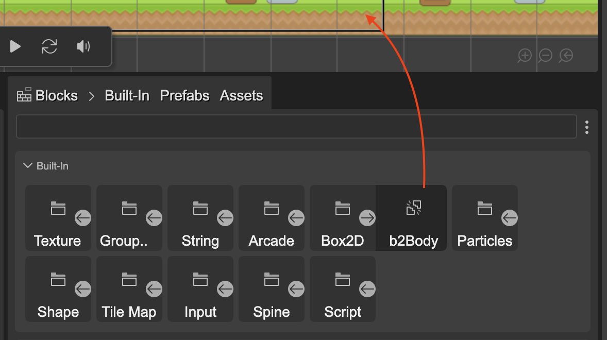
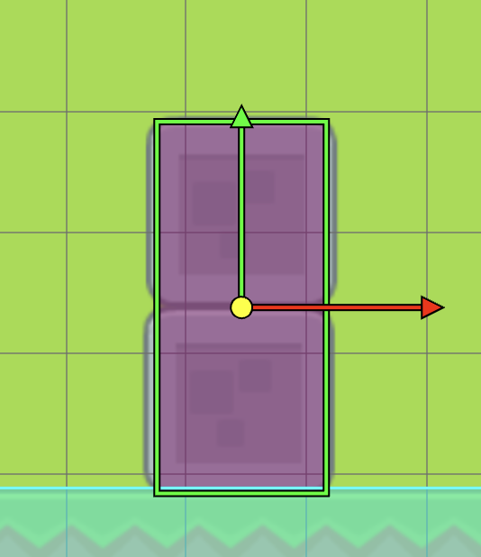

Box2D bodies are independent objects from Phaser game objects, you can add them to a scene or associate them with a game object.

To add a Box2D body to a scene, you have two options:

1. Drag the b2Body block from the Blocks view and drop it into the scene:

2. Open the scene context menu (right-click), and select the **Box2D Physics** → **Add Body To Scene** option:

To add a body to a Phaser game object, you must first select the object in the scene, and then activate the **Box2D Physics** → **Add Body To Sprite** option from the context menu:

Once the body is in the scene, you can edit its properties in the Inspector view:

## Box2D body transform properties

Since a Box2D body is independent of Phaser game objects, they have position and rotation. However, if the body is attached to a game object, the position of the body is synchronized with the position of the game object, so those fields are disabled.

The [Translate](../manipulation-tools#translate-tool) and [Rotate](../manipulation-tools#rotate-tool) manipulation tools are also available for Box2D bodies, which is an effective way to adjust the position and rotation of bodies. As mentioned, **Translate** can only be used on bodies that are not associated with a game object.

The following image shows a static body that is not associated with a game object. Visually it corresponds to two stone blocks forming a platform, but in the scene the body is independent of these blocks:

## Box2D body as a variable

For Phaser Editor, a Box2D body is not a game object, but it is an object in the scene that shares many characteristics with game objects:

- They are an independent object.
- You can assign a scope and a name to it, so the editor generates code to access them, such as fields and temporary variables.
- Although you cannot create a prefab of a Box2D body, you can declare them as a nested prefab.
- The [Variable](../game-objects/common-object-properties#variable-properties) section is shared by both game objects and Box2D bodies.

## Box2D body as nested prefab

The usual way to configure a Box2D body is through the configuration object that we pass in its constructor. For this reason, the nested prefabs of bodies need a special way to modify their properties. We call this special way **xargs**. You can learn more about **xargs** in the section [The nested prefab constructor and the xargs](../prefabs/prefab-nested#the-nested-prefab-constructor-and-the-xargs).