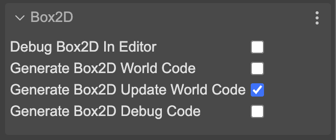
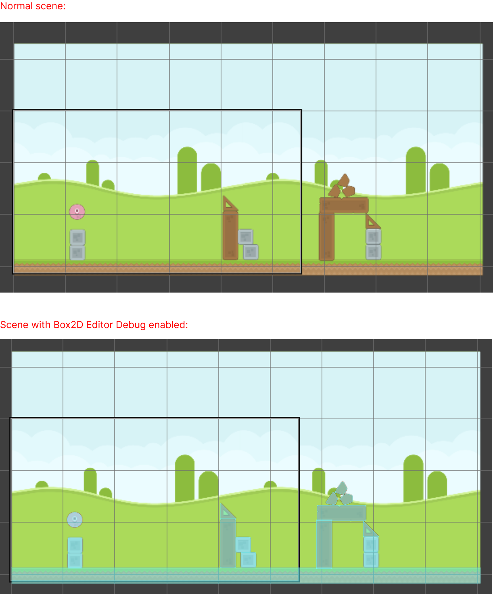

Box2D is not a native Phaser API, so some additional steps are required to prepare the project and the scenes where we will create the Box2D worlds.

## Preparing the project

To use Box2D in a Phaser project, you must first add the Box2D library to the project. To do this, you must get [the `PhaserBox2D.js` file from its repository](https://github.com/phaserjs/phaser-box2d/tree/main/dist), and then copy it to your project.

It is important that you keep the same name of the `PhaserBox2D.js` file, since Phaser Editor will use it to import the library in all the code that is generated.

An easy way to get started with Box2D and Phaser Editor is to create a project using the **Box2D Starter** project template, or the **Angry Balls** example template, available in the desktop version of Phaser Editor.


## Setting up the scene

To get physical bodies with Box2D, you must first create a world where these bodies will exist. Since Box2D is an API independent of Phaser, you must also run some routines to sync the physical bodies with Phaser visual objects.

All this code is generated by Phaser Editor, you just need to enable the corresponding parameters. In the Inspector view, the **Box2D** section is displayed:



By default, the scene does not generate the code to create the world, so the first step is to enable the **Generate Box2D World Code** parameter.

Once enabled, you will be able to verify the creation of the world in your scene:

```javascript
// Box2D world creation
SetWorldScale(40);
const world = CreateWorld({ worldDef: { 
    ...b2DefaultWorldDef()
}});
this.worldId = world.worldId;
```

As soon as you enable world code generation, a new section appears in the Inspector, where you can configure the world parameters:


### The update method

The Box2D world must be updated in each frame. To do this, you must enable the **Generate Box2D Update World Code** parameter. This will generate the code to update the world in the scene's `update` method:

```javascript
update(time, delta) {

	WorldStep({ worldId: this.worldId, deltaTime: delta });
	UpdateWorldSprites(this.worldId);
}
```

However, you may need to write your own update method, so you can disable this parameter and write the code manually. In that case, the editor generates an `updateWorld()` method that you can call from your custom `update` method.

This is the method generated by the editor:

```javascript
updateWord(time, delta) {

	WorldStep({ worldId: this.worldId, deltaTime: delta });
	UpdateWorldSprites(this.worldId);
}
```

And this is how you can call it from your custom `update` method:

```javascript
update(time, delta) {

    this.updateWorld(time, delta);

    // your custom code here
}
```

### The debug draw

In a physics game, it is very useful to visualize the physical bodies. You have two parameters related to debug drawing. The first one is to enable the debug draw in the editor, and the second one is to enable the debug draw in the game (generated code).

So, when you enable **Debug Box2D In Editor**, the scene will display the physical bodies in the editor:




If you enable the parameter **Generate Box2D Debug Code**, the editor will generate the code to draw the physical bodies in the game. In this matter it is important that you copy the `PhaserDebugDraw.js` file in your project, since it contains all the debug drawing routines. You can [get it from its repository](https://github.com/phaserjs/box2d-examples/blob/main/examples/phaser/PhaserDebugDraw.js).
