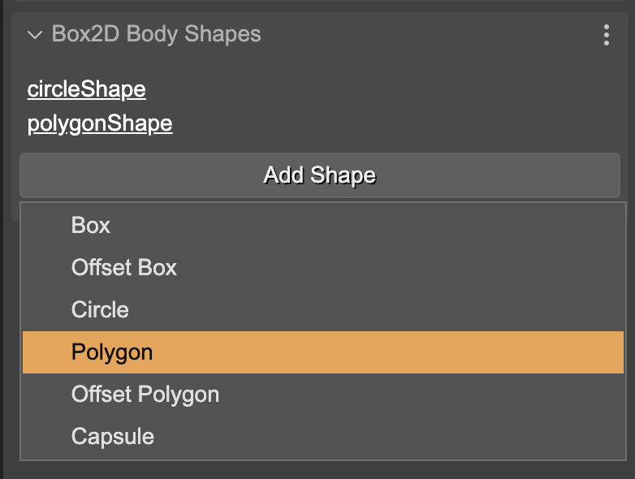
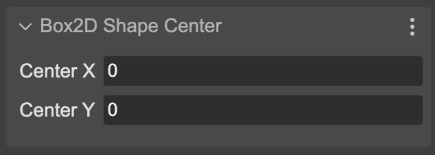
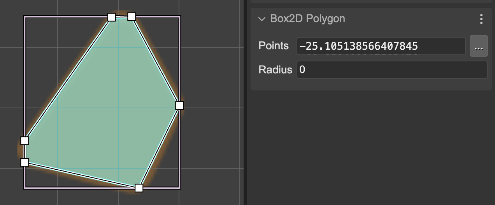
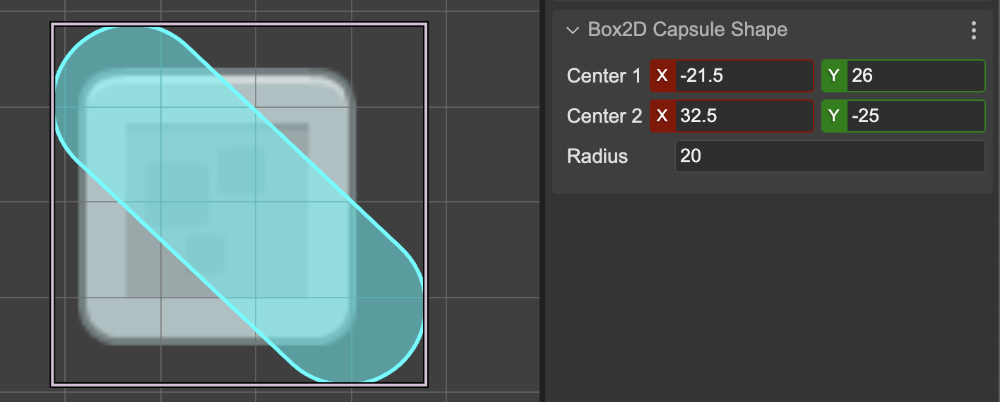

Box2D shapes are the building blocks of Box2D bodies. You can create shapes and add them to a Box2D body. The shapes define the physical properties of the body, such as mass, friction, and restitution.

Phaser Editor provides the tools for you to create and adjust shapes visually, although it does not yet cover all shape types.

To add a shape to a body, select the body in the scene (or in the Outline view) and activate the context menu (right-click) **Box2D Physics** and select one of the options to add a shape:

Another way to add a shape is from the **Box2D Body Shapes** section in the Inspector view. This section shows a shortcut to all body shapes plus a button to add a new shape:

The purpose of the shortcuts is that you can select a shape and edit its properties in the Inspector view.

## Shapes as independent objects

Like bodies, shapes are independent of game objects and bodies themselves. You can select a shape in the Outline view and edit its properties in the Inspector view.

You can also [assign a variable](../game-objects/common-object-properties#variable-properties) to a shape and access it from the code generated by the Phaser Editor. As well as declaring it as a nested prefab. Although for [the reasons explained in the previous section](./box2d-physics-add-body#box2d-body-as-nested-prefab), for the moment you will not be able to modify its properties in the nested prefab instances.

## Properties common to all shapes

All shape types have common properties that can be edited in the **Box2D Shape** section in the Inspector view:

There are also other properties that are common to a group of shapes, which we will see next.

## Shape center properties

Some shapes, like Circle and Offset Box, can be centered with an offset from the body center. You can edit the center properties in the **Box2D Shape Center** section in the Inspector view:

Also, you can change these properties using the [Translate tool](../manipulation-tools#translate-tool).

## Shape angle property

A group of shapes can be rotated around the body center or its own center. You can edit the angle property in the **Box2D Shape Angle** section in the Inspector view:

You can also change the angle using the [Rotate tool](../manipulation-tools#rotate-tool).

## Shape size properties

Some shapes have size properties, or better said, half-size properties. You can edit these properties in the **Box2D Shape Size** section in the Inspector view:

You can also change the size using the [Resize tool](../manipulation-tools#resize-tool).

## Box Shape

The Box shape is a rectangle with a width and height. You can edit the size properties in the [Size section](#shape-size-properties) or with the [Resize tool](../manipulation-tools#resize-tool).

## Offset Box Shape

The Offset Box shape is a rectangle with a width and height, but it can be centered with an offset from the body center, and rotated. You can edit the center properties in the [Center section](#shape-center-properties) or with the [Translate tool](../manipulation-tools#translate-tool), and change the angle with the [Angle section](#shape-angle-property) or with the [Rotate tool](../manipulation-tools#rotate-tool).

## Circle Shape

The Circle shape is a circle with a radius and a center. You can edit the radius properties in the **Radius section** or with the [Resize tool](../manipulation-tools#resize-tool). You can edit the center properties in the [Center section](#shape-center-properties) or with the [Translate tool](../manipulation-tools#translate-tool).

## Polygon Shape

The Polygon shape is a polygon with a list of vertices and a radius. You can edit the vertices in the **Polygon section** or using the [visual Polygon tool](../manipulation-tools#polygon-tool):

## Offset Polygon Shape

The same of the [Polygon](#polygon-shape) shape but with a center offset and rotation. You can edit the center properties in the [Center section](#shape-center-properties) or with the [Translate tool](../manipulation-tools#translate-tool), and change the angle with the [Angle section](#shape-angle-property) or with the [Rotate tool](../manipulation-tools#rotate-tool).

## Capsule Shape

The Capsule shape is a capsule with a radius and two center points. You can edit the properties in the **Box2D Capsule Shape section**:

## A Box2D shapes as nested prefab

The usual way to configure a Box2D shape is through the configuration object that we pass in its constructor. For this reason, the nested prefabs of shapes need a special way to modify their properties. We call this special way **xargs**. You can learn more about **xargs** in the section [The nested prefab constructor and the xargs](../prefabs/prefab-nested#the-nested-prefab-constructor-and-the-xargs).