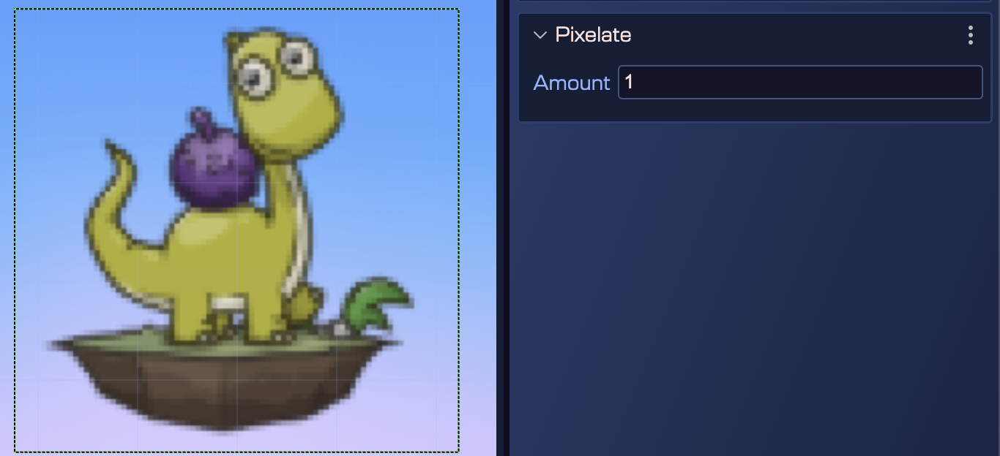
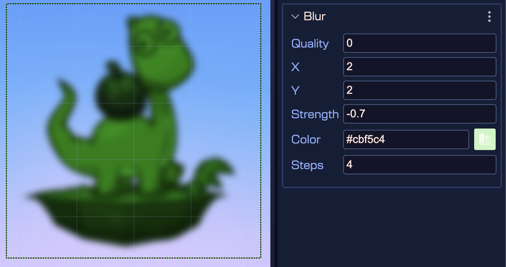
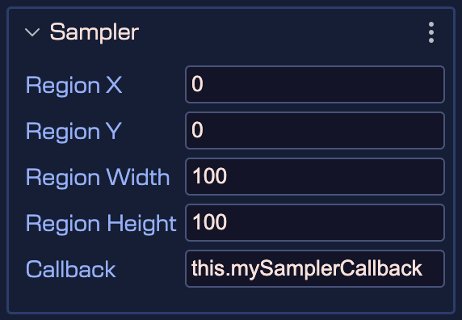
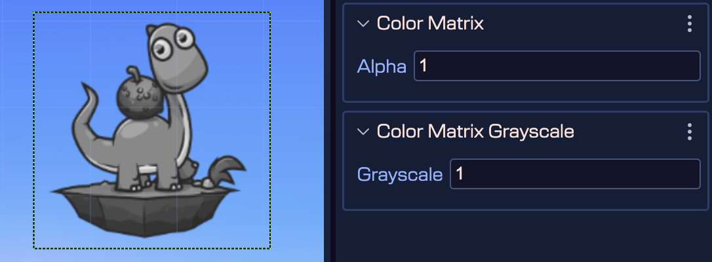

Phaser 4 introduced a couple of special filter effects. The effects are built-in, ready to use, and can be applied to any Game Object.

In Phaser Editor you can add effects to a Game Object, tweak the properties, and see the result in the Scene Editor.

These are the effects it supports:

## Adding a filter to a game object

Every game object has a **Filters** section in the Inspector view:


It contains the **Add** button that allows you to add a new effect to the game object. When you click the **Add** button, the **Shader Effects** dialog appears:


There you can select a filter, and then click the **Add** button to add it to the game object.

Another way to add a filter is to select a game object in the scene, open the context menu and populate the **Filter** submenu. It shows the options to add a specific filter:


You can add multiple filters to a game object. They are listed in the Outline view just like any other scene object:


You can select a filter object and delete it, copy/paste it, [change its rendering order](working-with-parent-objects#changing-the-rendering-order-of-children), or tweak its properties.

The Filter object is like any other scene object, by using the [Variable properties](./game-objects/common-object-properties#variable-properties), you can assign the filter to a variable, or a field, or set as a [nested prefab](./prefabs/prefab-nested).

Let’s say you want to tween the intensity of the shadow filter. You can assign the filter to a field by setting the variable scope to **CLASS**:


Then the [scene compiler](../scene-editor/scene-compiler) generates a variable and field for the FX object:

```javascript
editorCreate() {
    ...
    // shadowFx
    const shadowFx = logo.filters.internal.addShadow(0, 0, 0.1, 1, 0, 6, 1);
    ...
    this.shadowFx = shadowFx;
}

private shadowFx!: Phaser.Filters.Shadow;
```

Then, in the **create** method, you can tween the intensity of the shadow FX:

```javascript
create() {
    ...
    this.add.tween({
        targets: this.shadowFx,
        intensity: 1,
    });
}
```

Not only you can assign a filter to a variable, but you can also make a [nested prefab](./prefabs/prefab-nested) with it. This way, you can reuse the filter in different scenes.

## Filter properties

Every filter type shares a common set of properties. You can edit these properties in the **Filter** section. The properties are about the padding of the filter and the filter list it belongs to (`Internal` or `External`):


## Glow

The Glow is a simple filter that adds a glow to the edges of the image.

[Learn more about the Phaser.Filters.Glow properties in the Phaser documentation](https://docs.phaser.io/api-documentation/class/filters-glow)


## Shadow

The Shadow is a simple and easy-to-use shadowing filter for your images. You can learn more about its properties in the [Phaser.Filters.Shadow Phaser documentation](https://docs.phaser.io/api-documentation/class/filters-shadow).


## Pixelate

The Pixelate filter is a visual technique that deliberately reduces the resolution or detail of an image, creating a blocky or mosaic appearance composed of large, visible pixels. This filter can be used for stylistic
purposes, as a homage to retro gaming, or as a means to obscure certain elements within the game, such as during a transition or to censor specific content.

[Learn more about the Phaser.Filters.Pixelate properties in the Phaser documentation](https://docs.phaser.io/api-documentation/class/filters-pixelate)



## Blur

A Gaussian blur is the result of blurring an image by a Gaussian function. It is a widely used effect,
typically to reduce image noise and reduce detail. The visual effect of this blurring technique is a
smooth blur resembling that of viewing the image through a translucent screen, distinctly different
from the bokeh effect produced by an out-of-focus lens or the shadow of an object under usual illumination.

[Learn more about the Phaser.Filters.Blur properties in the Phaser documentation](https://docs.phaser.io/api-documentation/class/filters-blur)



## Barrel

A barrel effect allows you to apply either a 'pinch' or 'expand' distortion to
a Game Object. The amount of the effect can be modified in real-time.

[Learn more about the Phaser.Filters.Barrel properties in the Phaser documentation](https://docs.phaser.io/api-documentation/class/filters-barrel)


## Displacement

This filter will draw a displacement around the texture of the Game Object, effectively masking off any area outside of the displacement without the need for an actual mask. You can control the thickness of the displacement, the color of the displacement and the color of the background, should the texture be transparent. You can also control the feathering applied to the displacement, allowing for a harsh or soft edge.

Please note that adding this effect to a Game Object will not change the input area or physics body of the Game Object, should it have one.

[Learn more about the Phaser.Filters.Displacement properties in the Phaser documentation](https://docs.phaser.io/api-documentation/class/filters-displacement)


## Bokeh

Bokeh refers to a visual effect that mimics the photographic technique of creating a shallow depth of field. This effect is used to emphasize the game’s main subject or action, by blurring the background or foreground elements, resulting in a more immersive and visually appealing experience. It is achieved through rendering techniques that simulate the out-of-focus areas, giving a sense of depth and realism to the game’s graphics.

See also Tilt Shift.

[Learn more about the Phaser.Filters.Bokeh properties in the Phaser documentation](https://docs.phaser.io/api-documentation/class/filters-bokeh)

!

## Blend

This filter controller manages the blend effect for a Camera. A blend effect allows you to apply another texture to the view using a specific blend mode. This supports blend modes not otherwise available in WebGL.


## Mask

The Mask filter is a special filter that allows you to apply a mask to a Game Object. This filter is used to create a variety of effects, such as revealing or hiding parts of the object based on the mask texture. Phaser allows you to use any texture as a mask, or even a game object as a mask.

In Phaser Editor, we divided the Mask into two different objects: **TextureMask** and **ObjectMask**.

### TextureMask

A background image with a texture mask applied to it:


Same filter, but inverted:


### ObjectMask

You can use any game object as a mask. For example, a particle emitter can be used as a mask for a background image:


## Threshold

Input values are compared to a threshold value or range. Values below the threshold are set to 0, and values above the threshold are set to 1. Values within the range are linearly interpolated between 0 and 1. This is useful for creating effects such as sharp edges from gradients, or for creating binary effects.

The threshold is stored as a range, with two edges. Each edge has a value for each channel, between 0 and 1. If the two edges are the same, the threshold has no interpolation, and will output either 0 or 1. Each channel can also be inverted.


## Sampler

This filter manages a sampler. It doesn't actually render anything, and leaves the image unaltered. It is used to sample a region of the camera view, and pass the results to a callback. This is useful for extracting data from the camera view. This operation is expensive, so use sparingly.



## ColorMatrix

ColorMatrix refers to a visual effect that mimics the photographic technique of creating a shallow depth of field. This effect is used to emphasize the game’s main subject or action, by blurring the background or foreground elements, resulting in a more immersive and visually appealing experience. It is achieved through rendering techniques that simulate the out-of-focus areas, giving a sense of depth and realism to the game’s graphics.

[Learn more about the Phaser.Filters.ColorMatrix properties in the Phaser documentation](https://docs.phaser.io/api-documentation/class/filters-colormatrix)

The ColorMatrix FX has different presets that can be used to create different effects.

The presets are:


All presets have in common the Alpha property, which allows you to set the alpha of the filter. The other properties are specific to each preset.


