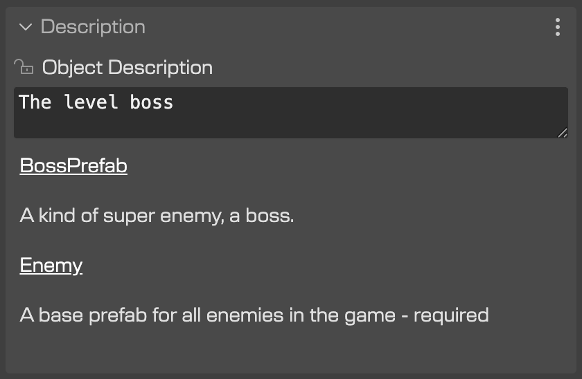
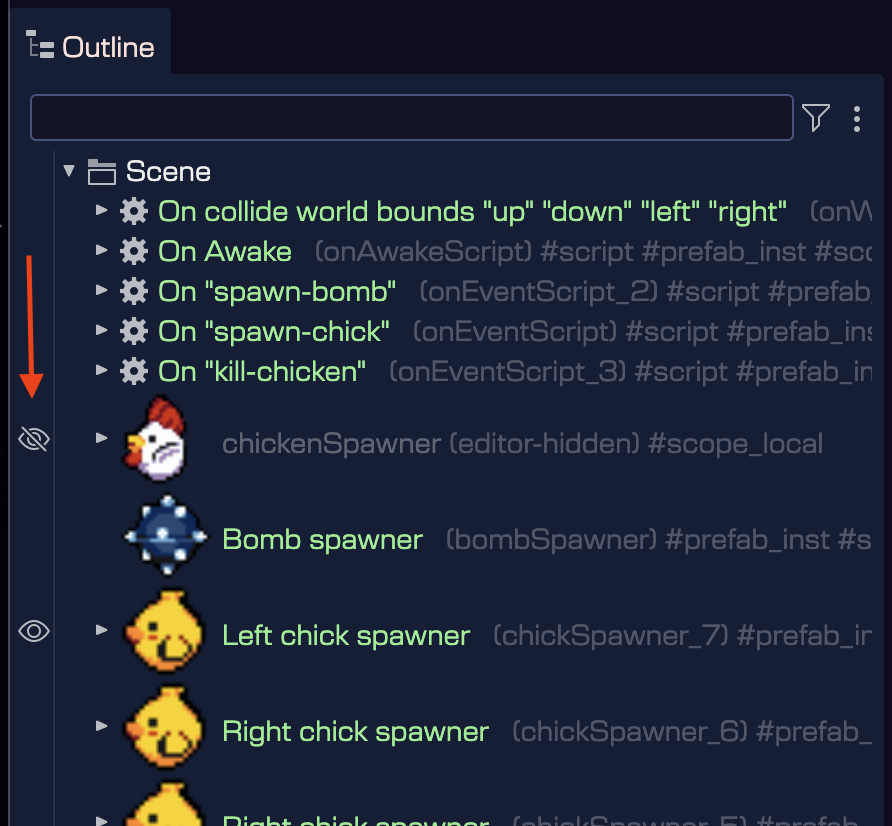

The properties of the objects are listed and grouped in the [Inspector view](../inspector-view). In this view, you can modify the properties of the selected objects.

In this chapter, we cover the properties that are common to different game objects.

## Variable properties

The [variable properties]() are introduced by the Scene Editor to be used by the Outline view and the [scene compiler](../scene-compiler).

### Name property

This name is auto generated by the editor:


It is used as the label in the Outline view:


And as a variable name in the generated code:


### Display Name property

You can change the default text of the game object in the Outline view by setting the **Display Name** property. This display name is used only by the UI.


### Game Object Name property

The **GO Name** property indicates if the previous **Name** property’s value will be set as value to the [Game Object’s name property](https://docs.phaser.io/api-documentation/class/gameobjects-gameobject#name).

Check the **GO Name** property:


For generating the `name` value in code:


### Type property

This property shows the type of the selected object. In the case of prefabs, it shows the name of the prefab and the Phaser type that is the root of the prefab. For example: `prefab PlayButton (Image)`.

Also, you can click on the type name to change the type of the selected objects. It opens the [Replace Type dialog](./replace-object-type):


### Scope property

The scope property refers to the lexical scope of the variable that references the object. The possible values are:

* `LOCAL`: The variable is local to the creation of the object. It is optional, the compiler may generate it or not according if the object properties are modified.
* `METHOD`: The variable is available in the method’s scope.
* `CLASS`: The variable is assigned to a private class field. The object is accessible from any other method of the class.
* `PUBLIC`: Like the `CLASS` scope, but it is referenced by a public field. The object is accessible to any client of the class.
* `NESTED_PREFAB`: Like `PUBLIC`, but the object is also available as [nested prefab](../prefabs/prefab-nested) instance in the Scene Editor. It means, you can change its properties using the scene editor.

By default, the scope is set to `LOCAL`. In previous versions of the editor, the default value was `METHOD`, but now we are using `METHOD` to ensuring the [scene compiler](../scene-compiler) generates a variable for the object.

## Description property

You can add a description to the object with the **Description** property. This could be useful for documenting the purpose of the object in the scene.

If the object is a prefab instance, then this section shows the [description of the prefab scenes](../scene-properties#scene-display-properties).




## Lists properties

The [Lists](#lists-properties) property is not part of the Phaser API. It is a property used by the Scene Editor to add objects to a list. It is the “parent lists” of the object.

As you can learn in the [Object List](../object-list) section, the editor allows to group objects in lists.

The button next to the property shows the lists that the object belongs to. You can click on the button to:

* Add the object to another list.
* Remove the object from a list.


## Parent properties

The Parent property shows the parent’s (a [Container](./container-object), a [Layer](./layer-object), or the scene) of the selected object.

You can click on the button to move the object to new parent.

When you change the parent of an object, the local position of the object is modified to keep the same absolute position.


Also, you can open this dialog with the [Move To Parent](../working-with-parent-objects#moving-an-object-to-a-parent) command.

## Children properties

The [containers](./container-object) and [layers](./layer-object) are objects with children, and share children-based properties.

The **Children** properties are not part of the Phaser API, they are used only by the editor, in design-time.

The **Allow Picking Children In Scene** property allows picking a child in the scene. If it is disable, you cannot pick a child by clicking in the scene. This is useful if you want to manipulate the parent container (or layer) and children as a single object.

The **Show Children In Outline** parameter is similar. It allows showing the container or layer children in the Outline view.


The **Allow Append Children** parameter indicates this Layer or Container allows adding new children in prefab instances. This parameter has sense only if the object has a nested prefab scope. [Learn more about adding children to a prefab instance](../prefabs/prefab-instance-children).

## Transform properties

The [transform properties](#transform-properties) of the object can be modified in the Inspector view or by using the [manipulation tools](../manipulation-tools).


* The [X](https://docs.phaser.io/api-documentation/class/gameobjects-components-transform#x) and [Y](https://docs.phaser.io/api-documentation/class/gameobjects-components-transform#x) of the position. See the [position manipulation tool](../manipulation-tools#translate-tool).
* The [scaleX](https://docs.phaser.io/api-documentation/class/gameobjects-components-transform#scalex) and [scaleY](https://docs.phaser.io/api-documentation/class/gameobjects-components-transform#scaley). The default value is `1`. See the [scale manipulation tool](../manipulation-tools#scale-tool).
* The [angle](https://docs.phaser.io/api-documentation/class/gameobjects-components-transform#angle), in degrees. The default value is `0`. See the [rotate manipulation tool](../manipulation-tools#rotate-tool).

## Origin properties

The [origin properties](https://docs.phaser.io/api-documentation/class/gameobjects-components-origin#setorigin) of the object can be modified in the Inspector view:


There are commands to change the origin to a preset value. These commands are available in the scene context menu or by pressing a key shortcut:


Also, you can change the origin of an object with the [origin manipulator tool](../manipulation-tools#origin-tool) or the [origin layout tool](../layout-tools/layout-tools-origin).

## Size properties

The [size properties]() of the object can be modified in the Inspector view or by using the [manipulation tools](../manipulation-tools).


These properties, **Width** and **Height**, are available for game objects like the [TileSprite](tile-sprite-object), [Rectangle](./shape-rectangle-object), [Ellipse](./shape-ellipse-object), the [NineSlice](nine-slice-object), and others.

In addition to writing the values into the property editors, you can use the [Resize manipulator tool](../manipulation-tools#resize-tool) (`Z`) for changing the size of the object in the scene.

## Flip properties

The [flipX](https://docs.phaser.io/api-documentation/class/gameobjects-components-flip#flipx) and [flipY](https://docs.phaser.io/api-documentation/class/gameobjects-components-flip#flipy) properties of the object.
 


## Visibility properties

The [visible](https://docs.phaser.io/api-documentation/class/gameobjects-components-visible#visible) property of the object indicates when the object is shown in the scene. It is a Phaser built-in property. You can use the **Toggle Visibility** command (`V`) to toggle the visibility of the selected objects in the scene.

The **Render in Editor** property is an editor-only property that controls if the object is rendered in the scene editor or not. It is useful for hiding objects that are only used at runtime, like spawn points, triggers, etc. You can use the **Toggle Editor Render** command (`H`) to toggle this property, and the **Set All Render in Editor** command to enable this property in all the objects in the scene.


In addition to the parameter and the commands, the Outline view shows an icon in the gutter to toggle the **Render in Editor** property of an object:



## Alpha properties

These properties allow setting transparency to the objects.

The [alpha](https://docs.phaser.io/api-documentation/class/gameobjects-components-alpha#alpha) property sets global transparency to the object. The `alphaTopLeft`, `alphaTopRight`, `alphaBottomLeft` and `alphaBottomRight` properties of the [Alpha component](https://docs.phaser.io/api-documentation/class/gameobjects-components-alpha) add interpolated transparency to the corners of the object.


## Alpha single property

The [alpha](https://docs.phaser.io/api-documentation/class/gameobjects-components-alphasingle#alpha) property sets global transparency to the object.


## Blend Mode properties

The [blendMode](https://docs.phaser.io/phaser/blend-mode) property sets the who the game object blends with the objects behind it.

## Tint properties

The [tint properties](https://docs.phaser.io/api-documentation/class/gameobjects-components-tint#tinttopleft) of the object are shown in the **Tint** section of the Inspector view:


By default, the [tint properties](https://docs.phaser.io/api-documentation/class/gameobjects-components-tint#tinttopleft) have a default value of `#FFFFFF`. To reset it to the default value you can delete it in the text field. You can write any CSS valid color format (`#ff0000`, `red`, `rgb(255, 0, 0)`).
At code generation, the value is converted to an integer, as the [tint properties](https://docs.phaser.io/api-documentation/class/gameobjects-components-tint#tinttopleft) requires.

## Texture property

The Scene Editor supports a couple of object types with texture:

* [Image](./image-object)
* Sprite
* [Tile Sprite](./tile-sprite-object)

The Scene Editor provides an Inspector view section to set the texture of an object:


It shows a button with the key of the image in the [Asset Pack file](../../asset-pack-editor/asset-pack-file). If the texture is taken from a texture map or sprite-sheet, then it shows that key too.

To change the texture of the object, click on the button, it will open the **Select Texture** dialog. This dialog shows all the textures available in the [Asset Pack file](../../asset-pack-editor/asset-pack-file), and you can select the new texture for the object.


You can open the dialog with the **Replace Texture** command. This command can be executed by pressing the `X` key, selecting it in the context menu or the [Command Palette](../../workbench/command-palette).

The **Replace Texture Frame** (`M`) is a special command that allows you selecting a different texture frame for the object. It means, it will show all the frames of the same atlas (or sprite-sheet):


The context menu also shows the **Select All With Same Texture** command. This command selects all the objects with a texture equals to the texture of the selected object. It can help you to replace an old texture with a new texture of all the objects of a scene.


The **Show Texture in Asset Pack Editor** option opens the Asset Pack File where the texture is defined.

## Animation properties

The animation properties section contains the parameters of the [play()](https://docs.phaser.io/api-documentation/class/gameobjects-sprite#play) method of the Sprite game object:


The **Animation Preview** parameter allows you to play the animation in real-time in the scene editor. It is disabled by default. When you enable it, it starts the [scene's update loop](../misc#play-scene-update-loop) and shows the animation in the scene editor:

The **Action** parameter indicates what method execute to play the animation:

* **NONE** (default): Doesn’t call any method, doesn’t play any animation.
* **PLAY**: Calls the [play()](https://docs.phaser.io/api-documentation/class/gameobjects-sprite#play) method.
* **PLAY_REVERSE**: Calls the [playReverse()](https://docs.phaser.io/api-documentation/class/gameobjects-sprite#playreverse) method.


The **Animation Key** parameter contains the key of the animation to play:


Next to the key name, there are two buttons. A button for opening an animation key selection dialog and a button for previewing the selected animation.

The animation key selection dialog:


The animation preview dialog:


This dialog searches for animations defined in a [Phaser animations file](../../animations-editor/) or in the [Aseprite](../sprite-animations#aseprite-animation-support) assets included in an [Asset Pack file](../../asset-pack-editor/asset-pack-file).

This is the code the [scene compiler](../scene-compiler) generates for playing the animation:

```javascript
dragon.play("dragon - dragon/Moving Forward");
```

Or, if you select the **PLAY_REVERSE** action:

```javascript
dragon.playReverse("dragon - dragon/Moving Forward");
```

When you define the animations in the [Animations Editor](../../animations-editor) or in Asesprite, you configure parameters like repetitions, duration, direction, etc… However, in the scene, you can pass a custom configuration to the [play()](https://docs.phaser.io/api-documentation/class/gameobjects-sprite#play) method. To do this in the Scene Editor you have to check the **Custom Config** parameter.

If the **Custom Config** parameter is selected, then it shows the **Animation Configuration** section. It shows all the parameters you can set to an animation:


When you set the custom configuration, the [scene compiler](../scene-compiler) generates this code:

```javascript
dragon.play({
    "key": "dragon - dragon/Moving Forward"
    "frameRate": 10,
    "repeat": -1
});
```

## Text property

There are a couple of object types in Phaser dedicated to displaying a text. The Scene Editor, for now, supports the BitmapText and Text types.

The [text property]() can be edited in the **Text Content** section of the Inspector view.


