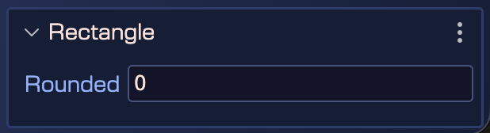

You can create a [Rectangle](https://docs.phaser.io/api-documentation/class/gameobjects-rectangle) by dropping the **Rectangle** block, from the Blocks view, on the scene.


You can change the size of the Rectangle in the **Size section** or you can use the [Size tool](../manipulation-tools#resize-tool).


Since Phaser 4, you can set the **Rounded** property to give rounded corners to the rectangle. By default it is set to `0` (no rounded corners).



The [Rectangle](https://docs.phaser.io/api-documentation/class/gameobjects-rectangle) code is generated by the [scene compiler](../scene-compiler) using the [rectangle object factory](https://docs.phaser.io/api-documentation/class/gameobjects-gameobjectfactory#rectangle):

```javascript
const rectangle = this.add.rectangle(10, 10, 100, 100);
```
