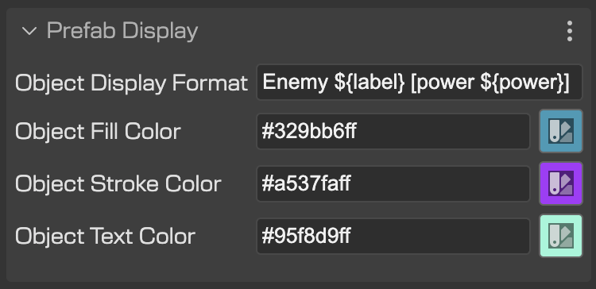
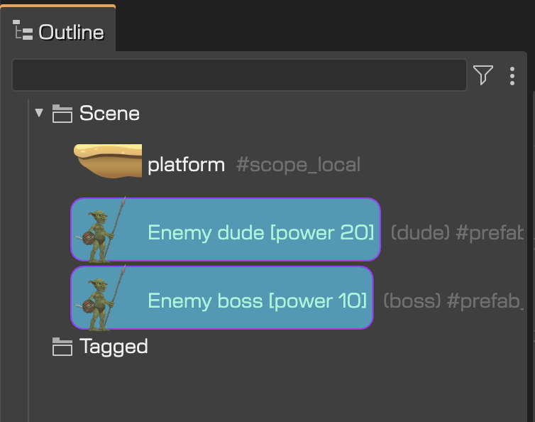

When you create a prefab instance, the Outline view shows the variable’s name as the display name of the object.

Let’s see this example.

The variable name of the button is **buttonDown**:

… and the Outline view uses the same name for labeling the object:

However, you can change the labeling of the object with a more descriptive name. You can set the **Object Display Name** in the **Prefab Display** properties section of the prefab’s scene:

The display name for the button instances will be `Button - ${action}`. It is a name template with placeholders, and the `${action}` placeholder is filled with the value of the **Action** prefab property of the button.

The `action` name is the variable name of the user property `Action`. You can hover the mouse in the property to get the property information:

Now, the buttons are shown in the Outline view with the new display names. Note the `${action}` expression is replaced by `UP`, `DOWN`, or `FIRE` depending on the value of the **Action** property:

This technique is particularly useful when you add objects but their variable names are not relevant to the game implementation. Or when you want to provide more detailed information about the objects.

This is the case of many script nodes:

In addition to the `${propName}` syntax, you can use a `#{propName}` expression. It will be replaced by the name of the property (`propName`) if the value of the property is `true`, `undefined`, `""`, or the equivalent in JavaScript.

This is an example. The display name is `Collide #{up} #{down}`. If the value of the `up` property is `true` and the `down` property is `false`, then the final display name will be `Collide #up`.

It means you can use this syntax for showing “tags”.

The Prefab Display properties section has also the properties:

- Object Fill Color
- Object Stroke Color
- Object Text Color

These properties allow you to set custom colors for the Outline view item representing the prefab instance:

