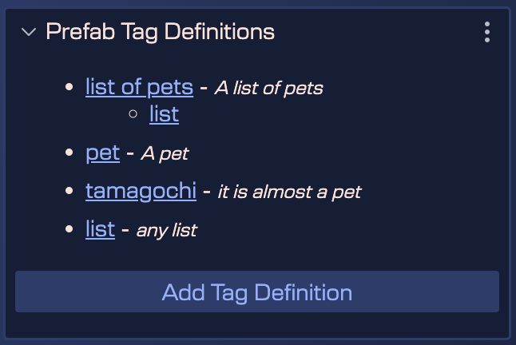
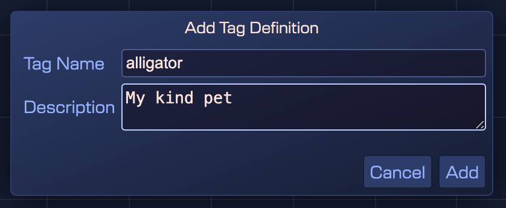
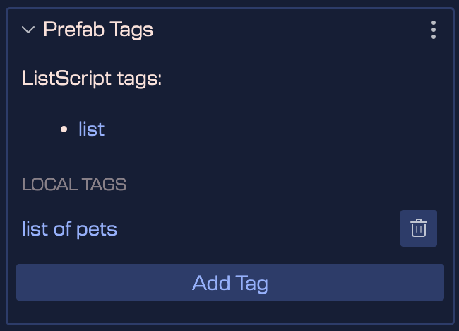

## Prefab tags

Prefab tags are a new mechanism in Phaser Editor that allows you to sort and filter content. Currently, tags are used in both [prefab constraints](../script-node/script-node-constraints.md) and [Game Object Reference user properties](./prefab-user-properties#game-object-reference-property-type).

The tags are defined in prefabs and applied to prefabs. Unlike [prefab constraints](../script-node/script-node-constraints) that are pre-defined by the editor, tags are defined by the user. That is to say, in order to apply a tag to a prefab, you must first define it in the same prefab or any other prefab of the project. A tag defined in a prefab can be used by any other prefab in the project.

A tag definition has a name, a description, and a set of super-tags.

To define a tag, the editor displays the **Prefab Tag Definitions** section in the Inspector view of the prefab. This section shows a list of the tags you have already defined in the prefab and a button to add a new definition (**Add Tag Definition**).

When you click the **Add Tag Definition** button, a dialog is displayed where you can type the name and description of the tag you want to define.

Then, this definition will appear in the list of definitions. Although as you can see, more than a list, it is a tree, since you can define hierarchical tags. For example, you can define a tag **list of pegs** which in turn has the super tag **list**. This means, that all the constraints that use the **list** tag also apply to the **list of pets** tag.

To create this tag hierarchy, you must click on the tag that you want to be the child of the new tag and select the **Add Super-Tag** option. This will open the dialog to define the new tag as a child of the selected tag.

In the same way, you can edit a tag definition or delete it.

### Add tags to a prefab

Once you have defined the tags you want to use, you can add them to a prefab. To do this, go to the **Prefab Tags** section of the prefab's Inspector view. There you will see a list of the tags you have already added to the prefab and a button to add a new tag (**Add Tag**).

As expected, a variant prefab inherits the tags from the original prefab. The following image shows the **ListOfPetsScript** prefab that inherits from the **ListScript** prefab. As you can see, the prefab **ListOfPetsScript** has the tag **list**, which is a tag defined in the prefab **ListScript**, and also the local tag **list of pets**.

For now we only use the prefab tags for the script node constraints. However, in the future we may use them for other purposes.