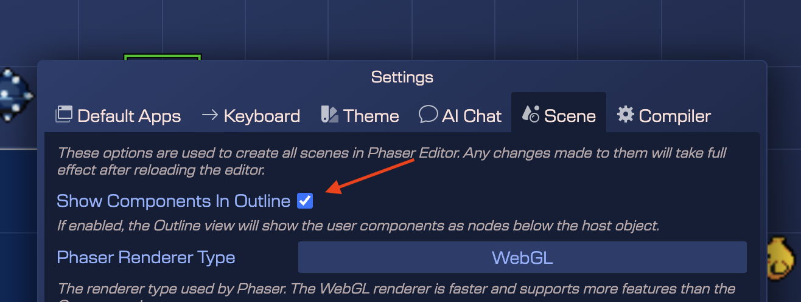

You can add a user component to an object (entity)  in two ways: manually, and with the Scene Editor.

Adding a component to an object manually:

```javascript
const platform = ...;
const move = new HorizontalMove(platform);
move.minX = 100;
move.maxX = 400;
```

The constructor of the user component **HorizontalMove** adds the component to the object. You can keep a reference to the component or get the component from the game object, with the **getComponent** method:

```javascript
const move = HorizontalMove.getComponent(platform);
```

However, the interesting is adding components to objects in the Scene Editor.

This is possible with the **Add User Component** command:

- Select an object.

- Execute the **Add User Component** command (`M`). It is also available in the context menu **Scripting** → **Add User Component**.

   
   
- The command opens a dialog with all the components defined in the project (grouped by the `*.components` files). Select the one you want to add:

   

- The Inspector view provides a new **HorizontalMove** section with the properties of the component:

   

## Generating the code for a component in an object

The [user components compiler](user-components-compiler) will generate the code to create the component, just like if you write it by hand:

```javascript
// bridge2 (components)
const bridge2HorizontalMove = new HorizontalMove(bridge2);
bridge2HorizontalMove.horizVelocity = 100;
bridge2HorizontalMove.minX = 10;
bridge2HorizontalMove.maxX = 400;
```

## Actions for a component

These are the actions associated to the user component of an object:


* **Select Objects With HorizontalMove**: selects in the scene all objects containing the **HorizontalMove** component.
* **Open Definition Of HorizontalMove**: opens the definition of the component in the [User Components Editor](./user-components-editor).
* **Move Up**, **Move Down**: changes the order of the component.
* **Delete**: deletes the component from the object.

## Browsing the User Components in a scene

You can take an overview of all the user components in all the objects of the scene with the **Browse User Components** (`Shift+M`) command:


You can enable the [setting](../../workbench/settings) **Show User Components in Outline** to show/hide the user components in the Outline view:



If that parameter is enabled, you will see the user components of an object in the Outline view:

