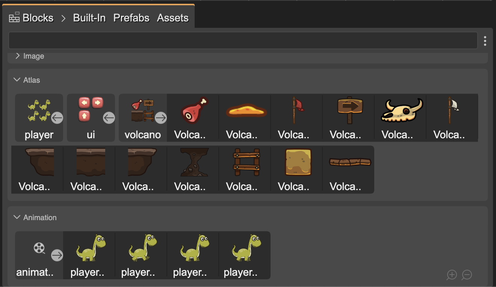

The Blocks view shows the building blocks of the current editor. This is a concept a bit different from other visual tools.

The common in other videogame creation tools is to provide an asset browser that displays all the assets present in the project.

The Blocks view displays only the assets, or “blocks”, that can be used in a particular editor.

For example, in the [Asset Pack Editor](../asset-pack-editor/intro), the user adds files to the [Asset Pack file](../asset-pack-editor/asset-pack-file). These files are shown as blocks in the Blocks view, but when a user adds a file to the editor, that file is hidden from the Blocks view  because it is already present there.

The Inspector view shows the properties of the elements selected in the Blocks view, or operations you can apply to them.

The Blocks view is a [content viewer](../misc/content-viewers): it shows an inline preview of its elements, you can zoom in/out it and filter its content.

