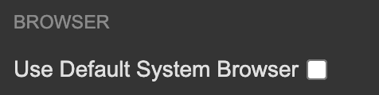
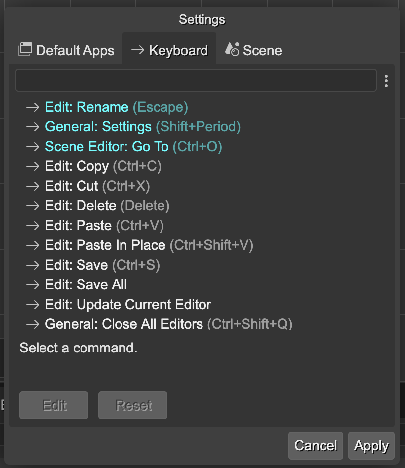
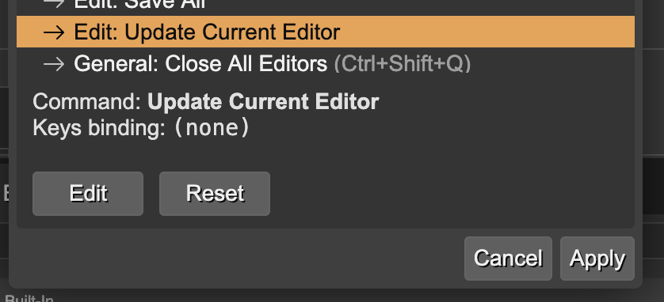
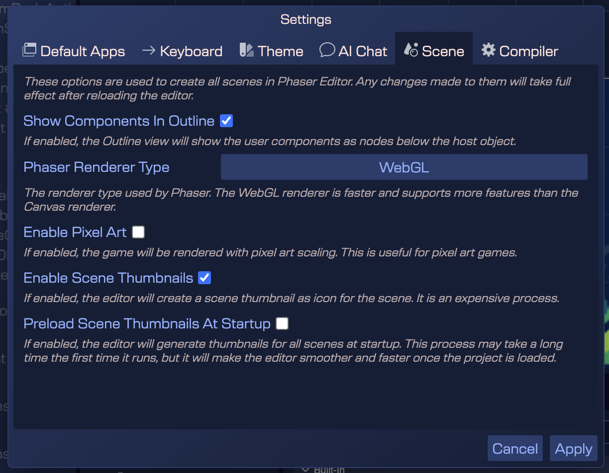

In this chapter we will learn about the settings UI in Phaser Editor.

You can open the settings dialog by clicking on the main menu, in the **Settings** option:


The settings dialog contains multiple tabs with different settings:

* Default Apps tab
* Keyboard tab
* Scene tab

There are settings that are stored globally, and others that are stored per project. In a following section we explain in details the different settings storages.

## Default Apps settings

Phaser Editor may use external applications to do two main tasks:

* Open the game in a browser.
* Open the project in an external code editor.

In this tab, you can set the default applications to use for these tasks.

### Default system browser

The **Browser** section contains the settings to open the game in a browser.

You can select the **Use Default System Browser** parameter to use the default system browser no matter the value of the other parameters:



### Custom browser

If you want to use a specific browser, you can set the **External Browser** parameter to the path of the browser executable. It is important to write the path between quotes (`"`) if it contains spaces. This is an example of path in macOS:

```
"/Applications/Google Chrome.app/Contents/MacOS/Google Chrome"
```

Note, in the right of the text field there is a three-dots menu with the following options:

* **Configure Chrome** - set a predefined path for Google Chrome.
* **Configure Firefox** - set a predefined path for Mozilla Firefox.
* **Configure Other...** - opens the system file chooser dialog to select the browser executable.


With the **External Browser Arguments** parameter, you can set the arguments to pass to the browser executable. The most important argument is the `$URL` variable, which contain the URL of the game to open:


### Custom code editor

In the **External Code Editor** section, you can set the default code editor to open the project files. The settings are similar to the browser settings. The **External Code Editor** parameter contains the path to the editor's executable. You should write the path between quotes (`"`) if it contains spaces. This is an example of the Visual Studio Code path in macOS:

```
"/Applications/Visual Studio Code.app/Contents/Resources/app/bin/code"
```

In the right of the text field there is a three-dots menu with the following options:

* **Configure Visual Studio Code** - set a predefined path for Visual Studio Code.
* **Configure JetBrains WebStorm** - set a predefined path for JetBrains WebStorm.
* **Configure JetBrains Rider** - set a predefined path for JetBrains Rider.
* **Configure Other...** - opens the system file chooser dialog to select the editor executable.

The **External Code Editor Arguments** parameter contains the arguments to pass to the editor executable. The most important argument is the `$LOC` variable, which contains the path of the file to open or the project's folder to open. You can add additional arguments.

The **External Code Editor Display Name** parameter is the name of the editor to display in the different places of the Phaser Editor's UI.


## Keyboard settings

In the **Keyboard** tab, you can set the keyboard shortcuts for the different commands in the Phaser Editor. The settings are stored globally, so they are the same for all the projects.

The tab shows all the commands and their current shortcuts. The commands with a custom key binding are highlighted and shown at the beginning of the list.



To change a shortcut, follow this steps:

- Select the command.
- Press the **Edit** button.
- Press the new key combination.
- If you want to cancel the change, press the **Cancel** button.



Also, you can reset the key bindings of a command by selecting it and pressing the **Reset** button.

## Theme settings

This section shows the [Color Themes available in Phaser Editor](../workbench/color-themes). You can select the theme to use in the workbench. The settings are stored globally local for each project.


## AI Chat settings

The AI Chat tab contains the settings for the internal chatbot of Phaser Editor. You can set the API key to use Google, OpenAI, and Anthropic LLM services. The keys are stored locally in your machine, and the editor connects directly to the services, without passing through any third-party server.

This is an experimental feature that may change in the future.


## Compiler settings

This tab contains the settings for the scene compiler. You can set the following parameters:

- **Spine Module Name**: the name of the Spine module to use in the generated code. By default, it is `@esotericsoftware/spine-phaser`.

## Scene settings

In the **Scene** tab, you can set the global settings of the scenes in the project:

- **Show User Components in Outline**: a flag to [show/hide the user components](../scene-editor/user-components/user-components-instancing#browsing-the-user-components-in-a-scene) in the Outline view of the Scene Editor.
- **Phaser Renderer Type** : the renderer type to use in the scenes. The available options are: WebGL and Canvas.
- **Enable Pixel Art**: a flag to enable the pixel art mode in the scenes. Tick this option of your game is pixel art.
- **Enable Scene Thumbnails**: a flag to enable/disable the generation of scene thumbnails. Making thumbnails is an expensive operation, so you can disable it to improve performance on very large projects.
- **Preload Scene Thumbnails At Startup**: a flag to enable/disable the preloading of scene thumbnails when opening a project. Preloading thumbnails may be intensive, but taking a time to load them at the startup may improve the performance of the editor when operating with scenes.

The settings are stored per project, in the `phasereditor2d.config.json` file, so they are different for each project. Learn more about the [project's configuration file](../misc/project-config).




