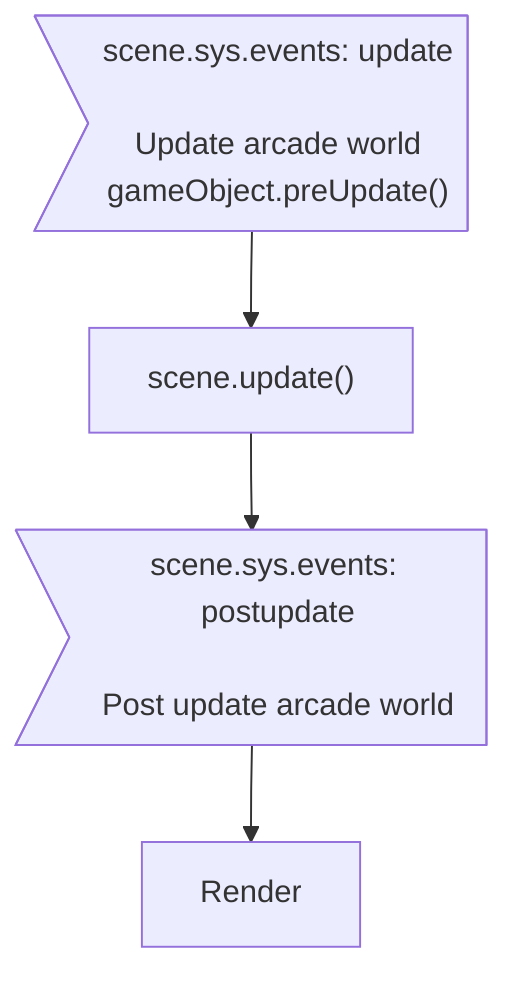

Arcade Physics is, as its name implies, meant for more 'arcade' or 'retro' style games, although is not limited just to those. It's a lightweight physics system that can only handle two different types of physics shapes: rectangles and circles. It's not meant for complex physics simulations, but rather for simple things like platformers, top-down games, or puzzle games. It's very fast and easy to use, with lots of helper functions, but due to its nature it does have its limitations.

Arcade Physics must be enabled before it can be used. This can be done via the Game Configuration or on a per-Scene basis. Once enabled, you can then add physics-enabled Game Objects to your game. This will allow you to control the Sprite using the built-in physics functions, such as velocity, acceleration, gravity, etc.

By default a Game Object is not enabled for physics. This is because not all Game Objects need to be. For example, a background image or game logo likely doesn't need to be affected by physics, but a player character does. Therefore, you must enable physics on the Game Objects that you specifically want to be affected by it. We will cover this in detail in later chapters.

Arcade Physics and Matter Physics are two separate systems. An Arcade Physics sprite, for example, cannot collide with a Matter Physics sprite. You cannot add the same Sprite to both systems, you need to pick one or the other. However, although it's unusual to do so, both systems can actually run in parallel in the same Scene. This means that you can have a Sprite that uses Arcade Physics and another that uses Matter Physics, and they will both work at the same time, although they will not interact together.

## Arcade World

The Arcade Physics World is the environment where all physics-based interactions occur within the Arcade Physics system. It manages the simulation of object movement, collisions, and responses to various forces. The Arcade Physics World tracks all the objects within it (referred to as "bodies"), handles their physical interactions, and updates their positions and velocities over time.

### Configuration

The Arcade Physics `config` object defines the behavior of the Arcade Physics system globally.

- Basic configuration object

```js
const config = {
    // ...
    physics: {
        default: 'arcade'
    },
    // ...
};

const game = new Phaser.Game(config);
```

- Full configuration

```js
const config = {
  // ...
  physics: {
    default: "arcade",
    arcade: {
      //    x: 0,
      //    y: 0,
      //    width: scene.sys.scale.width,
      //    height: scene.sys.scale.height,
      //    gravity: {
      //        x: 0,
      //        y: 0
      //    },
      //    checkCollision: {
      //        up: true,
      //        down: true,
      //        left: true,
      //        right: true
      //    },
      //    customUpdate: false,
      //    fixedStep: true,
      //    fps: 60,
      //    timeScale: 1,     // 2.0 = half speed, 0.5 = double speed
      //    customUpdate: false,
      //    overlapBias: 4,
      //    tileBias: 16,
      //    forceX: false,
      //    isPaused: false,
      //    debug: false,
      //    debugShowBody: true,
      //    debugShowStaticBody: true,
      //    debugShowVelocity: true,
      //    debugBodyColor: 0xff00ff,
      //    debugStaticBodyColor: 0x0000ff,
      //    debugVelocityColor: 0x00ff00,
      //    maxEntries: 16,
      //    useTree: true   // set false if amount of dynamic bodies > 5000
    },
  },
  // ...
};
const game = new Phaser.Game(config);
```

### Update

- Default updating : World updating every tick
- Custom updating :

  1. Set `customUpdate` of arcade config to `false`.
     - Enable world updating : `this.physics.enableUpdate()`
     - Disable world updating : `this.physics.disableUpdate()`
  2. Run world updating manually

     ```js
     this.physics.world.update(time, delta);
     ```

  3. Enable/disable world updating
     - Enable : `this.physics.enableUpdate()`
     - Disable : `this.physics.disableUpdate()`

#### Step

- Advances the simulation by a single step.

  ```js
  this.physics.world.singleStep();
  ```

- Advances the simulation by a time increment.

  ```js
  this.physics.world.step(delta);
  ```

### Control

#### Pause

```js
this.physics.pause();
```

#### Resume

```js
this.physics.resume();
```

#### Duration per frame

- Time scale

  ```js
  this.physics.world.timeScale = timeScale;
  ```

  - 1.0 = normal speed
  - 2.0 = half speed
  - 0.5 = double speed

- Frames per second (FPS)

  ```js
  this.physics.world.setFPS(framerate);
  ```

#### Tile filter options

```js
var option = this.physics.world.tileFilterOptions;
```

- `option`

  ```js
  {
      isColliding: true,
      isNotEmpty: true,
      hasInterestingFace: true
  }
  ```

### Body

#### Enable

```js
this.physics.world.enable(gameObject);
// this.physics.world.enable(gameObject, bodyType);
```

- `gameObject` : A game object, or array of game objects, or game objects in a `Group`.
- `bodyType` :
  - `0` : Dynamic body. Default value.
  - `1` : Static body.

Or

```js
this.physics.add.existing(gameObject, bodyType);
```

See [arcade-body](#get-physics-body)

#### Disable

```js
this.physics.world.disable(gameObject);
```

- `gameObject` : A game object, or array of game objects, or game objects in a `Group`.

#### Add/remove body

- Add body to the local search trees.

  ```js
  this.physics.world.add(body);
  ```

- Remove body from the local search trees.

  ```js
  this.physics.world.disableBody(body);
  ```

### Collision

#### Set bound

See bound in [body object](#body-collision-bounds), or [game object](#game-object-collision-bounds).

#### Collider & callback

- Add collider

  - Push out

    ```js
    this.physics.add.collider(objectsA, objectsB);
    ```

  - Performs a collision check and separation between the two physics enabled objects given.

    ```js
    var collider = this.physics.add.collider(
      objectsA,
      objectsB,
      collideCallback
    );
    // var collider = this.physics.add.collider(objectsA, objectsB, collideCallback, processCallback, callbackContext);
    ```

  - If you don't require separation then use `overlap` instead.

    ```js
    var collider = this.physics.add.overlap(
      objectsA,
      objectsB,
      collideCallback
    );
    // var collider = this.physics.add.overlap(objectsA, objectsB, collideCallback, processCallback, callbackContext);
    ```

  - Parameters

    - `objectsA`, `objectsB` :
      - A game object
      - An array contains Game objects (Add or remove game objects)
      - Physics group/Group (Add or remove game objects)
      - An array contains Physics group/Group
    - `collideCallback` :

      ```js
      var collideCallback = function (gameObject1, gameObject2) {
        // ...
      };
      ```

    - `processCallback` : Fired when gameObject1 intersects gameObject2, optional.

      ```js
      var processCallback = function (gameObject1, gameObject2) {
        return true; // return false will discard remaining collision checking
      };
      ```

- Remove collider

  ```js
  this.physics.world.removeCollider(collider);
  ```

- Deactivate collider

  ```js
  collider.active = false; // Set true to activate again
  ```

- Name of collider (unused by engine)

  ```js
  collider.name = name;
  ```

#### Testing without colliders

- Test overlapping

  ```js
  var isOverlapping = this.physics.world.overlap(object1, object2);
  ```

  or

  ```js
  var isOverlapping = this.physics.world.overlap(
    object1,
    object2,
    collideCallback
  );
  // var isOverlapping = this.physics.world.overlap(object1, object2, collideCallback, processCallback, callbackContext);
  ```

- Test colliding, also push out

  ```js
  var isCollided = this.physics.world.collide(object1, object2);
  ```

  or

  ```js
  var isCollided = this.physics.world.collide(
    object1,
    object2,
    collideCallback
  );
  // var isCollided = this.physics.world.collide(object1, object2, collideCallback, processCallback, callbackContext);
  ```

- A body overlaps with a Tile and has its `onOverlap` property set to `true`.

  ```js
  this.physics.world.on("tileoverlap", function (gameObject, tile, body) {
    /* ... */
  });
  ```

- A body overlaps with a Tile and has its `onCollide` property set to `true`.

  ```js
  this.physics.world.on("tilecollide", function (gameObject, tile, body) {
    /* ... */
  });
  ```

### Arcade world bounds

#### Enable

- [Body](#arcade-body) : Set `body.setCollideWorldBounds()` to enable worldBounds property.
- World :

  - Set bounds [rectangle](../geometry.md#rectangle) and enable bounds

    ```js
    this.physics.world.setBounds(x, y, width, height);
    // this.physics.world.setBounds(x, y, width, height, checkLeft, checkRight, checkUp, checkDown);
    ```

  - Set bounds [rectangle](../geometry.md#rectangle)

    ```js
    this.physics.world.bounds.setTo(x, y, width, height);
    ```

    or

    ```js
    this.physics.world.bounds.x = x;
    this.physics.world.bounds.y = y;
    this.physics.world.bounds.width = width;
    this.physics.world.bounds.height = height;
    ```

  - Enable bounds

    ```js
    this.physics.world.setBoundsCollision();
    // this.physics.world.setBoundsCollision(left, right, up, down);
    ```

    or

    ```js
    this.physics.world.checkCollision.left = left;
    this.physics.world.checkCollision.right = right;
    this.physics.world.checkCollision.up = up;
    this.physics.world.checkCollision.down = down;
    ```

  - Get bounds [rectangle](../geometry.md#rectangle)

    ```js
    var top = this.physics.world.bounds.top;
    var bottom = this.physics.world.bounds.bottom;
    var left = this.physics.world.bounds.left;
    var right = this.physics.world.bounds.right;
    ```

### Bodies inside an area

- Overlap a rectangle area

  ```js
  var bodies = this.physics.overlapRect(
    x,
    y,
    width,
    height,
    includeDynamic,
    includeStatic
  );
  ```

  - `includeDynamic` : Set `true` to search Dynamic Bodies
  - `includeStatic` : Set `true` to search Static Bodies

- Overlap a circle area

  ```js
  var bodies = this.physics.overlapCirc(
    x,
    y,
    radius,
    includeDynamic,
    includeStatic
  );
  ```

  - `includeDynamic` : Set `true` to search Dynamic Bodies
  - `includeStatic` : Set `true` to search Static Bodies

### Wrap

```js
this.physics.world.wrap(gameObject, padding);
```

- gameObject:
  - game object
  - group
  - array of game objects

### Move to

- Move to position with a steady velocity

  ```js
  this.physics.moveTo(gameObject, x, y, speed, maxTime);
  ```

- Move to object with a steady velocity

  ```js
  this.physics.moveToObject(gameObject, destination, speed, maxTime);
  ```

### Accelerate to

- Accelerate to position

  ```js
  this.physics.accelerateTo(
    gameObject,
    x,
    y,
    acceleration,
    xSpeedMax,
    ySpeedMax
  );
  ```

- Accelerate to object

  ```js
  this.physics.accelerateToObject(
    gameObject,
    destination,
    acceleration,
    xSpeedMax,
    ySpeedMax
  );
  ```

### Gravity

- Set

  ```js
  this.physics.world.gravity.x = gx;
  this.physics.world.gravity.y = gy;
  ```

- Get

  ```js
  var gx = this.physics.world.gravity.x;
  var gy = this.physics.world.gravity.y;
  ```

Total Gravity = world.gravity + body.gravity

### Bodies

#### Closest/furthest

- Closest

  ```js
  var body = this.physics.closest(point); // point: {x,y}
  // var body = this.physics.closest(point, targets);
  ```

  - `targets` : Array of Arcade Physics Game Object, Body or Static Body.

- Furthest

  ```js
  var body = this.physics.furthest(point); // point: {x,y}
  // var body = this.physics.furthest(point, targets);
  ```

  - `targets` : Array of Arcade Physics Game Object, Body or Static Body.

### Debug

#### Draw body & velocity

- Bounds of dynamic Body

  - Enable drawing body

    ```js
    this.physics.world.defaults.debugShowBody = true;
    ```

  - Color

    ```js
    this.physics.world.defaults.bodyDebugColor = 0xff00ff;
    ```

- Bounds of static Body

  - Enable drawing body

    ```js
    this.physics.world.defaults.debugShowStaticBody = true;
    ```

  - Color

    ```js
    this.physics.world.defaults.staticBodyDebugColor = 0x0000ff;
    ```

- Direction and magnitude of velocity

  - Enable drawing body

    ```js
    this.physics.world.defaults.debugShowVelocity = true;
    ```

  - Color

    ```js
    this.physics.world.defaults.velocityDebugColor = 0x00ff00;
    ```

#### Graphics

Draw debug body & velocity on a [Graphics object](../gameobjects/graphics.md).

```js
var graphics = this.physics.world.debugGraphic;
```

- Set visible

  ```js
  this.physics.world.debugGraphic.setVisible();
  ```

- Set invisible

  ```js
  this.physics.world.debugGraphic.setVisible(false);
  ```

### Events

- World step

  ```js
  this.physics.world.on("worldstep", function (delta) {
    /* ... */
  });
  ```

  - `delta` : The delta time amount of this step, in seconds.

- Pause world

  ```js
  this.physics.world.on("pause", function () {
    /* ... */
  });
  ```

- Resume world

  ```js
  this.physics.world.on("resume", function () {
    /* ... */
  });
  ```

- Two bodies overlap and at least one of them has their `onOverlap` property set to `true`.

  ```js
  this.physics.world.on(
    "overlap",
    function (gameObject1, gameObject2, body1, body2) {
      /* ... */
    }
  );
  ```

- Two bodies overlap and at least one of them has their `onCollide` property set to `true`.

  ```js
  this.physics.world.on(
    "collide",
    function (gameObject1, gameObject2, body1, body2) {
      /* ... */
    }
  );
  ```

- A body overlaps with a Tile and has its `onOverlap` property set to `true`.

  ```js
  this.physics.world.on("tileoverlap", function (gameObject, tile, body) {
    /* ... */
  });
  ```

- A body overlaps with a Tile and has its `onCollide` property set to `true`.

  ```js
  this.physics.world.on("tilecollide", function (gameObject, tile, body) {
    /* ... */
  });
  ```

- World bounds

  ```js
  this.physics.world.on(
    "worldbounds",
    function (body, blockedUp, blockedDown, blockedLeft, blockedRight) {
      /* ... */
    }
  );
  ```

### Update loop

1. scene.sys.events: update
   1. Update position & angle of each body
   1. Process each collider
   1. Update final position of each body
   1. Emit `worldstep` event
1. scene.sys.events: postupdate
   1. Draw debug graphics



## Arcade Body

An Arcade Physics Body is associated with a game object and manages its physics properties and behaviors.

### Usage

#### Get physics body

1. [Enable physics world](#configuration)
1. Add existing game object(s) to physics world
   - Add a game object

     ```js
     var gameObject = this.physics.add.existing(gameObject, bodyType);
     ```

     - `bodyType` :
       - `0` : Dynamic body
       - `1` : Static body
   - Add game objects

     ```js
     this.physics.world.enable(gameObjects, bodyType);
     ```

     - `gameObjects` : An array of game objects, or a group object
     - `bodyType` :
       - `0` : Dynamic body
       - `1` : Static body
1. Get physics body

   ```js
   var body = gameObject.body;
   ```

#### Enable and disable

Whether this Body is updated by the physics simulation.

- Enable (default)

  ```js
  body.setEnable();
  ```

  or

  ```js
  body.enable = true;
  ```

- Disable

  ```js
  body.setEnable(false);
  ```

  or

  ```js
  body.enable = false;
  ```

#### Direct control

Enable `directControl` when game object is controlled by tween or dragging. Default behavior is disable.

- Enable

  ```js
  body.setDirectControl(); // default argument is true
  // body.setDirectControl(true);
  ```

  or

  ```js
  body.directControl = true;
  ```

- Disable

  ```js
  body.setDirectControl(false);
  ```

  or

  ```js
  body.directControl = false;
  ```

#### Immovable

Whether this Body can be moved by collisions with another Body.

- Enable

  ```js
  body.setImmovable();
  // body.immovable = true;
  ```

- Disable (defalut)

  ```js
  body.setImmovable(false);
  // body.immovable = false;
  ```

- Get

  ```js
  var immovable = body.immovable;
  ```

#### Pushable

Sets if this Body can be pushed by another Body.

- Enable (default value of dynamic body)

  ```js
  body.pushable = true;
  ```

- Disable, reflect back all of the velocity it is given to the colliding body.

  ```js
  body.pushable = false;
  ```

- Get

  ```js
  var pushable = body.pushable;
  ```

#### Moveable

Whether the Body's position and rotation are affected by its velocity, acceleration, drag, and gravity.

- Enable (default)

  ```js
  body.moves = true;
  ```

- Disable

  ```js
  body.moves = false;
  ```

- Get

  ```js
  var moves = body.moves;
  ```

#### Destroy

Physics body will be destroyed automatically when game object is destroyed.

#### Movement

##### Velocity

- Set

  ```js
  body.setVelocity(x, y);
  ```

  or

  ```js
  body.setVelocityX(x);
  body.setVelocityY(x);
  ```

- Get

  ```js
  var vx = body.velocity.x;
  var vy = body.velocity.y;
  ```

##### Max speed

- Set

  ```js
  body.setMaxSpeed(speed);
  ```

- Get

  ```js
  var speed = body.maxSpeed;
  ```

##### Max velocity

- Set

  ```js
  body.setMaxVelocity(x, y);
  ```

  or

  ```js
  body.setMaxVelocityX(x);
  body.setMaxVelocityY(y);
  ```

- Get

  ```js
  var vx = body.maxVelocity.x;
  var vy = body.maxVelocity.y;
  ```

##### Acceleration

- Set

  ```js
  body.setAcceleration(x, y);
  ```

  or

  ```js
  body.setAccelerationX(x);
  body.setAccelerationY(y);
  ```

- Get

  ```js
  var ax = body.acceleration.x;
  var ay = body.acceleration.y;
  ```

##### Gravity

- Set

  ```js
  body.setGravity(x, y);
  ```

  or

  ```js
  body.setGravityX(x);
  body.setGravityY(y);
  ```

- Get

  ```js
  var gx = body.gravity.x;
  var gy = body.gravity.y;
  ```

- Enables (default)

  ```js
  body.setAllowGravity();
  ```

- Disable

  ```js
  body.setAllowGravity(false);
  ```

##### Drag

Reduces speed per second.

- Set

  ```js
  body.setDrag(x, y);
  ```

  or

  ```js
  body.setDragX(x);
  body.setDragY(y);
  ```

- Get

  ```js
  var dx = body.drag.x;
  var dy = body.drag.y;
  ```

- Enables (default)

  ```js
  body.setAllowDrag();
  ```

- Disable

  ```js
  body.setAllowDrag(false);
  ```

- Enable Damping (default: disable)

  ```js
  body.setDamping(true);
  // body.useDamping = true;
  ```

##### Slide factor

The Slide Factor controls how much velocity is preserved when this Body is pushed by another Body.

```js
body.slideFactor.set(x, y);
```

- `x`, `y` :
  - `1` : Take on all velocity given in the push. Default value.
  - `0` : Allow this Body to be pushed but then remain completely still after the push ends,
    such as you see in a game like _Sokoban_.
  - Other value between `0` ~ `1` : Keep `x`/`y` of the original velocity when the push ends.
    - Combine this with the `setDrag()` method to create deceleration.

##### Reset position

```js
body.reset(x, y);
```

##### Stop

Sets acceleration, velocity, and speed to zero.

```js
body.stop();
```

###### Friction

If this Body is `immovable` and in motion, this the proportion of this Body's movement received by the riding body on each axis.

- Set

  ```js
  body.setFriction(x, y);
  ```

  or

  ```js
  body.setFrictionX(x);
  body.setFrictionY(y);
  ```

- Get

  ```js
  var fx = body.friction.x;
  var fy = body.friction.y;
  ```

##### Speed

- The absolute (non-negative) change in this Body's horizontal/vertical position from the previous step.

  ```js
  var dx = body.deltaAbsX();
  var dy = body.deltaAbsY();
  ```

#### Rotation

##### Allow rotation

Whether this Body's rotation is affected by its angular acceleration and velocity.

- Enable (default)

  ```js
  body.setAllowRotation();
  ```

- Disable

  ```js
  body.setAllowRotation(false);
  ```

- Get

  ```js
  var allowRotation = body.allowRotation;
  ```

##### Angular velocity

- Set

  ```js
  body.setAngularVelocity(v);
  ```

- Get

  ```js
  var av = body.angularVelocity;
  ```

##### Angular acceleration

- Set

  ```js
  body.setAngularAcceleration(v);
  ```

- Get

  ```js
  var aa = body.angularAcceleration;
  ```

##### Angular drag

Reduces angular speed per second.

- Set

  ```js
  body.setAngularDrag(v);
  ```

- Get

  ```js
  var ad = body.angularDrag;
  ```

#### Collision

##### Collision category

By default all bodies collide with all other bodies. Collision categories define how different physics bodies interact with each other during collisions. It specifies which objects should collide and which should not. Collision categories are typically set using a bitmask, where each category is represented by a unique power of two. A body can collide with multiple collision categories.

- Collision category
  - Get

    ```js
    var collisionCategory = body.collisionCategory;
    ```

  - Set

    ```js
    body.setCollisionCategory(category);
    ```

    - `category` :
      - `(1 << 0)`
      - `(1 << 1)`
      - `(1 << 2)`
      - ...
      - `(1 << 31)`
  - Reset collision category, to default behavior (all bodies collide with all others)

    ```js
    body.resetCollisionCategory();
    ```

    - Set `collisionCategory` to `1`.
    - Set `collisionMask` to `1`
- Collision mask
  - Get

    ```js
    var collisionMask = body.collisionMask;
    ```

  - Set

    ```js
    body.setCollidesWith(categories);
    ```

    - `categories` : A single category value, or an array of them.
  - Add

    ```js
    body.addCollidesWith(category):
    ```

    - `category` : A single category value.
  - Remove

    ```js
    body.removeCollidesWith(category);
    ```

    - `category` : A single category value.

##### Body collision bounds

Collision bounds define the area used for collision detection.

- Rectangle

  ```js
  body.setSize(width, height, center);
  ```

  - `center` : `false` to set body's offset to (0, 0).
    - Not work in [Graphics](../gameobjects/graphics.md) object.
- Circle

  ```js
  body.setCircle(radius, offsetX, offsetY);
  ```

##### Collision Offset

Adjusts the position of a physics body's collision bounds relative to the sprite. Used when the sprite visual does not align with the collision area.

```js
body.setOffset(x, y);
```

##### Push out

Performs a collision check and separation between two physics enabled objects.

```js
this.physics.add.collider(objectsA, objectsB);
```

- `objectsA`, `objectsB` :
  - A game object
  - Game objects in array (Add or remove game objects)
  - Physics group (Add or remove game objects)
  - Group (Add or remove game objects)

##### Callbacks

Callbacks are functions that are called when collisions or overlaps occur between two objects every step.

```js
var collider = this.physics.add.collider(objectsA, objectsB, collideCallback, processCallback, callbackContext);
```

- `collideCallback` : The callback to invoke when the two objects collide.
- `processCallback` : The callback to invoke when the two objects collide. Must return a boolean.
- `callbackContext` : The scope in which to call the callbacks.

##### Point inside

The `hitTest` function checks if a specific point in the game world is colliding with any physics bodies. It returns `true` if a collision has occurred and `false` otherwise.

```js
var hit = body.hitTest(x, y);
```

##### Is colliding

- Is colliding this tick and which direction

  ```js
  var isColliding = body.touching;
  ```

  - `isColliding` :

    ```js
    {
        none: true,
        up: true,
        down: true,
        left: true,
        right: true
    }
    ```

- The colliding body's touching value during the previous step.

  ```js
  var wasColliding = body.wasTouching;
  ```

  - `wasColliding` :

    ```js
    {
        none: true,
        up: true,
        down: true,
        left: true,
        right: true
    }
    ```

##### Bounce

Defines how the body rebounds after colliding with another object. The bounce value is usually between 0 and 1. 0 stops the body from bouncing and makes it come to a stop upon collision. 1 makes the body will bounce back with the same velocity it had before the collision. A value greater than 1 makes increases the body's velocity after the collision.

- Set

  ```js
  body.setBounce(x, y);
  ```

  or

  ```js
  body.setBounceX(x); // horizontal bounce
  body.setBounceY(y); // vertical bounce
  ```

- Get

  ```js
  var bx = body.bounce.x;
  var by = body.bounce.y;
  ```

##### Body world bounds

- [Default world bounds](#arcade-world-bounds)
- Custom world bounds :

  ```js
  body.setBoundsRectangle(bounds);
  ```

  - `bounds` : A [rectangle object](https://newdocs.phaser.io/docs/latest/Phaser.Geom.Rectangle).
- Enable

  ```js
  body.setCollideWorldBounds();
  ```

- Disable (default)

  ```js
  body.setCollideWorldBounds(false);
  ```

- Get world bounds [rectangle](../geometry.md#rectangle)

  ```js
  var top = body.world.bounds.top;
  var bottom = body.world.bounds.bottom;
  var left = body.world.bounds.left;
  var right = body.world.bounds.right;
  ```

##### Blocked

Check whether this Body is colliding with a tile or the world boundary.

- Blocked when moving down

  ```js
  var onFloor = body.onFloor();
  // var onFloor = body.blocked.down
  ```

- Blocked when moving up

  ```js
  var onCeiling = body.onCeiling();
  // var onCeiling = body.blocked.up
  ```

- Blocked when moving left or right

  ```js
  var onWall = body.onWall();
  // var onLeftWall = body.blocked.left
  // var onRightWall = body.blocked.right
  ```

- State

  ```js
  var blocked = body.blocked;
  ```

  - `blocked` :

    ```js
    {
        none: true,
        up: false,
        down: false,
        left: false,
        right: false
    }
    ```

#### Mass

The Body's inertia, relative to a default unit (1). With bounce, this affects the exchange of momentum (velocities) during collisions.

- Set

  ```js
  body.setMass(m);
  ```

- Get

  ```js
  var m = body.mass;
  ```

#### Static body

A Static Arcade Physics Body never moves, and isn't automatically synchronized with its parent Game Object. Any changeg made to the parent's origin, position, or scale after creating or adding the body, requires manual update to the Static Body. A Static Body can collide with other Bodies, but is never moved by collisions.

##### Sync

Syncs the Bodies _position_ and _size_ with its parent Game Object.

```js
body.updateFromGameObject();
```

#### Debug

Draws a graphical representation of the StaticBody for visual debugging purposes.

- Bounds of Body
  - Enable drawing body

    ```js
    body.debugShowBody = true;
    ```

  - Color

    ```js
    body.debugBodyColor = 0xff00ff;
    ```

- Direction and magnitude of velocity
  - Enable drawing body

    ```js
    body.debugShowVelocity = true;
    ```

## Arcade Game Object

Game Objects are the building blocks of your game. Common Arcade Game Objects include: Sprites, Images, and Groups.

### Usage

#### Adding Game Objects

##### Image object

- Static object, extends from [Image object](https://newdocs.phaser.io/docs/latest/Phaser.Physics.Arcade.Image)

  ```js
  var image = this.physics.add.staticImage(x, y, key);
  ```

- Dynamic object, extends from [Image object](https://newdocs.phaser.io/docs/latest/Phaser.Physics.Arcade.Image)

  ```js
  var image = this.physics.add.image(x, y, key);
  ```

##### Sprite object

- Static object, extends from [Sprite object](https://newdocs.phaser.io/docs/latest/Phaser.Physics.Arcade.Sprite)

  ```js
  var image = this.physics.add.staticSprite(x, y, key, frame);
  ```

- Dynamic object, extends from [Sprite object](https://newdocs.phaser.io/docs/latest/Phaser.Physics.Arcade.Sprite)

  ```js
  var image = this.physics.add.sprite(x, y, key, frame);
  ```

##### Group object

- Static sprite objects, extends from [Group object](https://newdocs.phaser.io/docs/latest/Phaser.Physics.Arcade.Group)

  ```js
  var group = this.physics.add.staticGroup(children, config);
  // var group = this.physics.add.staticGroup(config);
  ```

- Dynamic sprite objects, extends from [Group object](https://newdocs.phaser.io/docs/latest/Phaser.Physics.Arcade.Group)

  ```js
  var group = this.physics.add.group(children, config);
  // var group = this.physics.add.staticGroup(config);
  ```

  - `config`

    ```js
    var config = {
      classType: ArcadeSprite,
      enable: true,
      collideWorldBounds: false,
      customBoundsRectangle: null,
      accelerationX: 0,
      accelerationY: 0,
      allowDrag: true,
      allowGravity: true,
      allowRotation: true,
      useDamping: false,
      bounceX: 0,
      bounceY: 0,
      dragX: 0,
      dragY: 0,
      gravityX: 0,
      gravityY: 0,
      frictionX: 0,
      frictionY: 0,
      maxSpeed: -1,
      velocityX: 0,
      velocityY: 0,
      maxVelocityX: 10000,
      maxVelocityY: 10000,
      angularVelocity: 0,
      angularAcceleration: 0,
      angularDrag: 0,
      mass: 0,
      immovable: false,

      maxSize: -1,
      runChildUpdate: false,
    };
    ```

##### Enable body

- Enable body

  ```js
  gameObject.enableBody();
  // gameObject.enableBody(false, 0, 0, enableGameObject, showGameObject);
  ```

  - Enable and reset position

    ```js
    gameObject.enableBody(true, x, y);
    // gameObject.enableBody(true, x, y, enableGameObject, showGameObject);
    ```

  - `enableGameObject` : Also activate this Game Object.
  - `showGameObject` : Also show this Game Object.
- Disable body

  ```js
  gameObject.disableBody();
  // gameObject.disableBody(disableGameObject, hideGameObject);
  ```

  - `disableGameObject` : Also deactivate this Game Object.
  - `hideGameObject` : Also hide this Game Object.

#### Movement

##### Velocity

- Set

  ```js
  gameObject.setVelocity(x, y);
  ```

  or

  ```js
  gameObject.setVelocityX(x);
  gameObject.setVelocityY(y);
  ```

- Get

  ```js
  var vx = gameObject.body.velocity.x;
  var vy = gameObject.body.velocity.y;
  ```

###### Max velocity

- Set

  ```js
  gameObject.setMaxVelocity(x, y);
  ```

- Get

  ```js
  var vx = gameObject.body.maxVelocity.x;
  var vy = gameObject.body.maxVelocity.y;
  ```

##### Acceleration

- Set

  ```js
  gameObject.setAcceleration(x, y);
  ```

  or

  ```js
  gameObject.setAccelerationX(x);
  gameObject.setAccelerationY(y);
  ```

- Get

  ```js
  var ax = gameObject.body.acceleration.x;
  var ay = gameObject.body.acceleration.y;
  ```

###### Gravity

- Set

  ```js
  gameObject.setGravity(x, y);
  ```

  or

  ```js
  gameObject.setGravityX(x);
  gameObject.setGravityY(y);
  ```

- Get

  ```js
  var gx = gameObject.body.gravity.x;
  var gy = gameObject.body.gravity.y;
  ```

##### Drag

- Set

  ```js
  gameObject.setDrag(x, y);
  ```

  or

  ```js
  gameObject.setDragX(x);
  gameObject.setDragY(y);
  ```

- Get

  ```js
  var dx = gameObject.body.drag.x;
  var dy = gameObject.body.drag.y;
  ```

- Enable damping

  ```js
  gameObject.setDamping(value);
  ```

##### Immovable

- Enable

  ```js
  gameObject.setImmovable();
  ```

- Disable

  ```js
  gameObject.setImmovable(false);
  ```

- Get

  ```js
  var immovable = gameObject.body.immovable;
  ```

##### Pushable

- Enable

  ```js
  gameObject.setPushable();
  ```

- Disable

  ```js
  gameObject.setPushable(false);
  ```

- Get

  ```js
  var pushable = gameObject.body.pushable;
  ```

###### Slide factor

The Slide Factor controls how much velocity is preserved when this Body is pushed by another Body.

```js
gameObject.setSlideFactor(x, y);
```

- `x`, `y` :
  - `1` : Take on all velocity given in the push. Default value.
  - `0` : Allow this Body to be pushed but then remain completely still after the push ends,
    such as you see in a game like _Sokoban_.
  - Other value between `0` ~ `1` : Keep `x`/`y` of the original velocity when the push ends.
    - Combine this with the `setDrag()` method to create deceleration.

###### Friction

If this Body is `immovable` and in motion, this the proportion of this Body's movement received by the riding body on each axis.

- Set

  ```js
  gameObject.setFriction(x, y);
  ```

  or

  ```js
  gameObject.setFrictionX(x);
  gameObject.setFrictionY(y);
  ```

- Get

  ```js
  var fx = gameObject.body.friction.x;
  var fy = gameObject.body.friction.y;
  ```

##### Direct control

Enable `directControl` when game object is controlled by tween or dragging. Default behavior is disable.

- Enable

  ```js
  gameObject.setDirectControl();
  // gameObject.setDirectControl(true);
  ```

- Disable

  ```js
  gameObject.setDirectControl(false);
  ```

!!! note "Use case"
Enable `setDirectControl` when game object is controlled by tween or dragging.

#### Rotation

##### Allow rotation

Whether this Body's rotation is affected by its angular acceleration and velocity.

- Enable (default)

  ```js
  body.setAllowRotation();
  ```

- Disable

  ```js
  body.setAllowRotation(false);
  ```

- Get

  ```js
  var allowRotation = gameObject.body.allowRotation;
  ```

##### Angular velocity

- Set

  ```js
  gameObject.setAngularVelocity(v);
  ```

- Get

  ```js
  var av = gameObject.body.angularVelocity;
  ```

##### Angular acceleration

- Set

  ```js
  gameObject.setAngularAcceleration(v);
  ```

- Get

  ```js
  var aa = gameObject.body.angularAcceleration;
  ```

##### Angular drag

- Set

  ```js
  gameObject.setAngularDrag(v);
  ```

- Get

  ```js
  var ad = gameObject.body.angularDrag;
  ```

#### Collision

##### Collision category

By default all bodies collide with all other bodies. Collision categories define how different physics bodies interact with each other during collisions. It specifies which objects should collide and which should not. Collision categories are typically set using a bitmask, where each category is represented by a unique power of two. A body can collide with multiple collision categories.

- Collision category
  - Get

    ```js
    var collisionCategory = gameObject.body.collisionCategory;
    ```

  - Set

    ```js
    gameObject.setCollisionCategory(category);
    ```

    - `category` :
      - `(1 << 0)`
      - `(1 << 1)`
      - `(1 << 2)`
      - ...
      - `(1 << 31)`
  - Reset collision category, to default behavior (all bodies collide with all others)

    ```js
    gameObject.resetCollisionCategory();
    ```

    - Set `collisionCategory` to `1`.
    - Set `collisionMask` to `1`
- Collision mask
  - Get

    ```js
    var collisionMask = gameObject.body.collisionMask;
    ```

  - Set

    ```js
    gameObject.setCollidesWith(categories);
    ```

    - `categories` : A single category value, or an array of them.
  - Add

    ```js
    gameObject.addCollidesWith(category):
    ```

    - `category` : A single category value.
  - Remove

    ```js
    gameObject.removeCollidesWith(category);
    ```

    - `category` : A single category value.

##### Game Object collision bounds

Collision bounds define the area used for collision detection.

- Rectangle

  ```js
  gameObject.setBodySize(width, height, center);
  ```

  - `center` : `false` to set body's offset to (0, 0)
- Circle

  ```js
  gameObject.setCircle(radius, offsetX, offsetY);
  ```

###### Offset

```js
gameObject.setOffset(x, y);
```

##### Push out

Performs a collision check and separation between two physics enabled objects.

```js
this.physics.add.collider(objectsA, objectsB);
```

- `objectsA`, `objectsB` :
  - A game object
  - Game objects in array (Add or remove game objects)
  - Physics group (Add or remove game objects)
  - Group (Add or remove game objects)

##### Callbacks

Callbacks are functions that are called when collisions or overlaps occur between two objects every step.

```js
var collider = this.physics.add.collider(objectsA, objectsB, collideCallback, processCallback, callbackContext);
```

- `collideCallback` : The callback to invoke when the two objects collide.
- `processCallback` : The callback to invoke when the two objects collide. Must return a boolean.
- `callbackContext` : The scope in which to call the callbacks.

#### Point inside

The `hitTest` function checks if a specific point in the game world is colliding with any physics bodies. It returns `true` if a collision has occurred and `false` otherwise.

```js
var hit = gameObject.hitTest(x, y);
```

##### Bounce

- Set

  ```js
  gameObject.setBounce(x, y);
  ```

  or

  ```js
  gameObject.setBounceX(x);
  gameObject.setBounceY(y);
  ```

- Get

  ```js
  var bx = gameObject.body.bounce.x;
  var by = gameObject.body.bounce.y;
  ```

- Enable bounce when colliding with the world boundary

  ```js
  gameObject.setCollideWorldBounds();
  ```

- Disable bounce when colliding with the world boundary

  ```js
  gameObject.setCollideWorldBounds(false);
  ```

#### Mass

The Body's inertia, relative to a default unit (1). With bounce, this affects the exchange of momentum (velocities) during collisions.

- Set

  ```js
  gameObject.setMass(m);
  ```

- Get

  ```js
  var m = gameObject.body.mass;
  ```

#### Static game object

##### Sync

Syncs the Bodies position and size in static game object.

```js
gameObject.refreshBody();
```

#### Methods of group

```js
group.setVelocity(x, y, step);
```

```js
group.setVelocityX(value, step);
```

```js
group.setVelocityY(value, step);
```

```js
group.refresh(); // call this method when position of game objects were changed in static object group
```

#### Debug

Draws a graphical representation of the Game Object for visual debugging purposes.

```js
gameObject.setDebug(showBody, showVelocity, bodyColor);
```

```js
gameObject.setDebugBodyColor(bodyColor);
```

## Author Credits

Content on this page includes work by:

- [RexRainbow](https://github.com/rexrainbow)